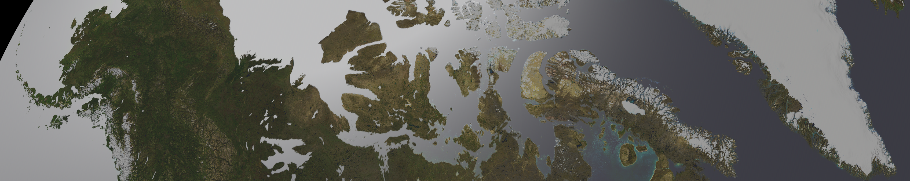
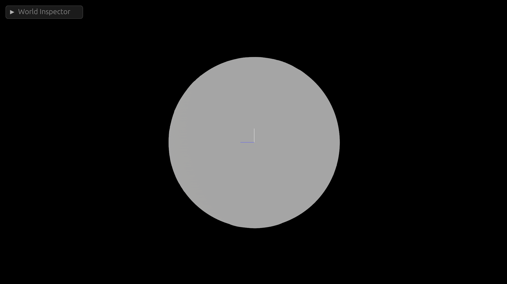

+++
title = "Bevy Procedural Earth Part 1: Mesh"
date = 2023-10-03
[taxonomies]
	tags = [ "Rust", "Bevy", "Gamedev", "Procedural Mesh" ]
+++



Of all the youtube game vloggers on the internet, [Sebastian Lague](https://www.youtube.com/@SebastianLague) is probably my favorite. Even though I have never written anything in Unity (and probably never will, especially given recent events.) I still find a lot of his videos inspirational.

One of his [videos](https://youtu.be/sLqXFF8mlEU?si=YTEgdMKiDiSr2nzk) in particular spurred me to do something I previously didn't have a whole lot of interest in: procedurally generating meshes. So I decided to go about implementing his idea in Bevy with a few twists.

While his video was a excellent starting spot, C# and Rust are drastically different languages so translating between them didn't always get me the results I expected. In addition, there were some bits he glossed over (forgivable, otherwise the video would have been 6 hours long) that I felt deserved a bit more explanation in text form.

Now, some disclaimers; I'm probably not going to be able to publish the full source of this project because the assets are far too large for Github. I may publish a torrent magnet link or something at some point, but if you want to follow along you will need to fill in some of the blank spots yourself as I'm going to be sharing piecemeal examples to illustrate some of the parts I found more difficult or less obvious (And yes, I know I just complained about people glossing over things. Sorry, not sorry.) If you have questions, feel free to reach out to me ([mastadon](https://hachyderm.io/@Darkside) is probably the best way.)

Also, fair warning, the example code is not minimal in any way and will be quite dense. It took me weeks to learn this stuff, so unpacking it all in a blog post is bound to be an interesting exercise.

So, disclaimer out of the way, lets get started.

# From Planes, A Sphere

Like in Sebastian's video, I'm also going to construct my earth from a set of planes. However, I wanted to be able to subdivide the earth into more than 6 planes as I wanted to support higher levels of zoom with higher resolution meshes. More objects means more culling (since you don't have to send quite as much data to the videocard memory at any given time) so my method is a little harder to follow than Sebastians:

```rust
pub fn generate_face(
    normal: Vec3,
    resolution: u32,
    x_offset: f32,
    y_offset: f32,
    rs: &RasterData,
) -> Mesh {
    let axis_a = Vec3::new(normal.y, normal.z, normal.x); // Horizontal
    let axis_b = axis_a.cross(normal); // Vertical

    // Create a vec of verticies and indicies
    let mut verticies: Vec<Vec3> = Vec::new();
    let mut indicies: Vec<u32> = Vec::new();
    let mut normals = Vec::new();
    for y in 0..(resolution) {
        for x in 0..(resolution) {
            let i = x + y * resolution;

            let percent = Vec2::new(x as f32, y as f32) / (resolution - 1) as f32;
            let point_on_unit_cube =
                normal + (percent.x - x_offset) * axis_a + (percent.y - y_offset) * axis_b;
            let point_coords: Coordinates = point_on_unit_cube.normalize().into();

			let normalized_point = point_on_unit_cube.normalize() * EARTH_RADIUS;

            verticies.push(normalized_point);

            normals.push(-point_on_unit_cube.normalize());

            if x != resolution - 1 && y != resolution - 1 {
                // First triangle
                indicies.push(i);
                indicies.push(i + resolution);
                indicies.push(i + resolution + 1);

                // Second triangle
                indicies.push(i);
                indicies.push(i + resolution + 1);
                indicies.push(i + 1);
            }
        }
    }
    let indicies = mesh::Indices::U32(indicies);
    let mut mesh = Mesh::new(PrimitiveTopology::TriangleList);
    mesh.set_indices(Some(indicies));
    mesh.insert_attribute(Mesh::ATTRIBUTE_POSITION, verticies);
    mesh.insert_attribute(Mesh::ATTRIBUTE_NORMAL, normals);
    mesh.generate_tangents().unwrap();
    mesh
}
```

So, lets break this down a bit further:

```rust
pub fn generate_face(
    normal: Vec3,
    resolution: u32,
    x_offset: f32,
    y_offset: f32,
) -> Mesh {
```

Starting with the signature, we are going to generate a plane facing in a direction, the direction is determined by the `normal`. This will make more sense when we look a the wrapper function that calls this one.

Our `resolution` determines the number of vertices we will generate.

The `x_offset` and `y_offset` will determine the offset from the central vector. This might not be very intuitive, but it allows us to generate more than 1 plane per "side" of the cube (that we will then turn into a sphere.) Again, this will be clearer once we see the wrapper function.

And our output will be a [Mesh](https://docs.rs/bevy/latest/bevy/prelude/struct.Mesh.html).

```rust
let axis_a = Vec3::new(normal.y, normal.z, normal.x); // Horizontal
let axis_b = axis_a.cross(normal); // Vertical
```
From our normal direction, we can derive the direction of our `x` and `y` axes of the plane. Fortunately this is very easy as Bevy provides some nice helper methods.

Then we initialize some things we will push various kinds of data into
```rust
// Create a vec of verticies and indicies
let mut verticies: Vec<Vec3> = Vec::new();
let mut indicies: Vec<u32> = Vec::new();
let mut normals = Vec::new();
```


And now it gets a little more interesting.

```rust
for y in 0..(resolution) {
        for x in 0..(resolution) {
            let i = x + y * resolution;

            let percent = Vec2::new(x as f32, y as f32) / (resolution - 1) as f32;
            let point_on_unit_cube =
                normal + (percent.x - x_offset) * axis_a + (percent.y - y_offset) * axis_b;
            let point_coords: Coordinates = point_on_unit_cube.normalize().into();
			let normalized_point = point_on_unit_cube.normalize() * EARTH_RADIUS;

            verticies.push(normalized_point);

            normals.push(-point_on_unit_cube.normalize());

            if x != resolution - 1 && y != resolution - 1 {
                // First triangle
                indicies.push(i);
                indicies.push(i + resolution);
                indicies.push(i + resolution + 1);

                // Second triangle
                indicies.push(i);
                indicies.push(i + resolution + 1);
                indicies.push(i + 1);
            }
        }
    }
}
```
The first part is probably pretty intuitive, we have a loop for `y` and `x` in resolution. This means that a resolution of 100 will result in 100x100 verticies per face. Next we have this `i` value, which is an Index. An index for what you might ask? Don't get ahead of yourself, we are going to spend a lot of time talking about this index in a minute.

```rust
let percent = Vec2::new(x as f32, y as f32) / (resolution - 1) as f32;
```
We need to know how far along we are with each face, so this will keep track of that in a vec2 for the x and y axis respectively.

```rust
let point_on_unit_cube =
	normal + (percent.x - x_offset) * axis_a + (percent.y - y_offset) * axis_b;
let point_coords: Coordinates = point_on_unit_cube.normalize().into();
let normalized_point = point_on_unit_cube.normalize() * EARTH_RADIUS;
```
Now we generate the actual xyz coordinates of our sphere. Now it may have seemed like we were going to generate a cube out of planes and then flatten them later, but in reality its a lot easier to do this in one step.

First we need to get the point on unit cube, this would be the pre-sphere point (if you used these coordinates for the verticies, it would actually be a cube with flat sides.) This is done by taking the normal and adding the normal plus our x and y percents, minus our x and y offset, times our `axis_a` and `axis_b` vectors.

Next, we take the resulting [Vec3](https://docs.rs/bevy/latest/bevy/math/struct.Vec3.html) and [normalize](https://docs.rs/bevy/latest/bevy/math/struct.Vec3.html#method.normalize) it. This is the step where our cube becomes a sphere. 

Now that we have the normalized point, we can make the earth whatever radius we want, in this case I'm using a constant of `300.0`, but you can make it whatever radius you want.

```rust
verticies.push(normalized_point);
normals.push(-point_on_unit_cube.normalize());
```

Now we need to push our normalized point to our verticies vec. Additionally, we will re-use our point_on_unit_cube variable to set the normal for this vertex correctly. This step probably isn't necessary; all of my normals were the correct way (we will talk about why in a second), but it is probably a good practice.

```rust
if x != resolution - 1 && y != resolution - 1 {
	// First triangle
	indicies.push(i);
	indicies.push(i + resolution);
	indicies.push(i + resolution + 1);

	// Second triangle
	indicies.push(i);
	indicies.push(i + resolution + 1);
	indicies.push(i + 1);
}
```

Now we need to unwrap this. In doing so, we will learn a fundemental truth of video-cards:

# Everything is a triangle

So we have a list of verticies already, and its probably rather intuitive that these verticies will make up the points of our mesh. But how do we draw the lines between each adjacent vertex in our plane? Heck, which vertexes do we draw lines between in the first place?

To answer this question, we have to talk about video cards. Video cards can only draw triangles [^1]. As a result, we need to construct our mesh from triangles. There are a lot of ways to do that, but we will be using Bevy's [PrimitiveTopology::TriangleList](https://docs.rs/bevy/latest/bevy/render/mesh/enum.PrimitiveTopology.html#variant.TriangleList).

This is one of the more primitive ways of constructing a mesh, but its also the closest to how the video card is actually going to render things which makes it very powerful (and often a bit less confusing for simpler shapes, like a plane.)

To generate this kind of mesh, we need two things (at a minium).

- A list of Vertex positions
- A list of Indicies that defining triangles

To explain this, lets start with a simple 2d example:
```

 (0, 0)              (1, 0)

   ┌───────────────────┐
   │                   │
   │                   │
   │                   │
   │                   │
   │                   │
   │                   │
   │                   │
   └───────────────────┘

 (0, 1)              (1, 1)

```
Since we must create our mesh from triangles, we need two triangles to re-create this box. For example:

```
Triangle 1: [(0,0), (1,0), (0,1)]
Triangle 2: [(0,1), (1,0), (1,1)]
```

However, this isn't going to work for our video card, because the order in which you specify the verticies is extremely important. In order to save a ton of memory and GPU cycles, most graphics libraries implement something called "backface culling" by default. This means they will only render one side of each triangle. So how do you tell the videocard which side of the face is the "front" vs the "back"?

According to the [docs](https://docs.rs/bevy/latest/bevy/prelude/struct.Mesh.html#use-with-standardmaterial):

```
Vertex winding order: by default, StandardMaterial.cull_mode is Some
(Face::Back), which means that Bevy would only render the “front” of each 
triangle, which is the side of the triangle from where the vertices appear 
in a counter-clockwise order.
```

This is our answer, the winding order of the verticies tells the videocard which side of the triangle is the "front" vs "back." If you want the face facing you, you wind from the counter-clockwise direction when looking at it from the outside (Or the "normal" direction.)

So a valid set of triangles for our example could be:
```
1: [(1,0), (0,0), (0,1)]
2: [(1,1), (1,0), (0,1)]
```

But how do we specify that in Bevy? Now we need to return to the Index we glossed over earlier.

Remember I said before we needed two things: A list of Verticies and an index that defines triangles. Well now that we know they must be counter-clockwise, we are armed with all the information we need to go about making them.

So, our list of verticies could be:

```
[(0,0), (0,1), (1,0), (1,1)]
```

And the indexes for our two triangles could be:
```
[0, 1, 2, 0, 2, 1]
```

This would mean our two triangles are:

```
1: [(1,0), (0,0), (0,1)]
2: [(1,1), (1,0), (0,1)]
```

If you aren't sure you got that, read it again and try to let it sink in. Its not intuitive *at all*, so don't feel bad if doesn't make much sense at first.

Once you grok that, we can go back to the code that generates our indexes:

```rust
if x != resolution - 1 && y != resolution - 1 {
	// First triangle
	indicies.push(i);
	indicies.push(i + resolution);
	indicies.push(i + resolution + 1);

	// Second triangle
	indicies.push(i);
	indicies.push(i + resolution + 1);
	indicies.push(i + 1);
}
```

Now, lets apply this to our 2d box example (which has a resolution of 1):

Starting at index 0, our first triangle indexes are:

```
(i, i+1, i+1+1)
```
Or:
```
(0, 1, 2)
```

And our second triangle indexes are:
```
(i, i+1+1, i+1)
```
Or:
```
(0, 2, 1)
```

Note that this strategy is entirely dependent on the way our loops are structured:

```rust
for y in 0..(resolution) {
	for x in 0..(resolution) {
	}
}
```
Because we are iterating over the y axis first and creating columns along the x axis, we need our index to look like:

```

 0                     2

   ┌───────────────────┐
   │                   │
   │                   │
   │                   │
   │                   │
   │                   │
   │                   │
   │                   │
   └───────────────────┘

 1                      3

```

And the last important bit is our if condition of `x != resolution - 1 && y != resolution - 1`. This ensures that we stop making triangles when we get to the end of a row or column.

Now, we need a function to wrap this one that will generate all sides of our cube-sphere:

```rust
pub fn generate_faces(
    mut commands: Commands,
    mut meshes: ResMut<Assets<Mesh>>,
    mut materials: ResMut<Assets<StandardMaterial>>,
    asset_server: Res<AssetServer>,
) {
    let faces = vec![
        Vec3::X,
        Vec3::NEG_X,
        Vec3::Y,
        Vec3::NEG_Y,
        Vec3::Z,
        Vec3::NEG_Z,
    ];

    let offsets = vec![(0.0, 0.0), (0.0, 1.0), (1.0, 0.0), (1.0, 1.0)];

    let mut rng = rand::thread_rng();

    for direction in faces {
        for offset in &offsets {
            commands.spawn((
                PbrBundle {
                    mesh: meshes.add(generate_face(direction, 16, offset.0, offset.1, &rs)),
                    material: materials.add(StandardMaterial {
                        ..default()
                    }),
                    ..default()
                }
            ));
        }
    }
}
```

This function will generate 24 faces, 4 per side of the "cube". The offsets and vectors hopefully make a bit more sense now.

The nice thing is, this method scales up to any resolution, so you can play around with varying polygon counts very easily.

And, here is what the end result looks like:



Not looking very interesting yet, is it? Don't worry, we will fix that soon! Stay tuned for Part 2.

[^1]: This is an Oversimplification. Video cards can draw all kinds of polygons in 2d. But in a 3d mesh, everything is always decomposed to triangles first. The chief reason being: 3 verticies is the exact number you need to uniquely specify a plane.