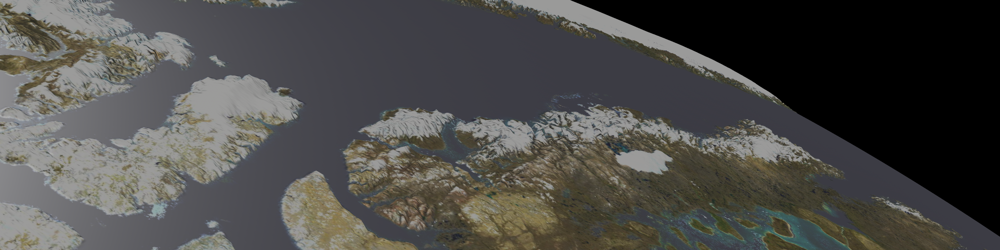
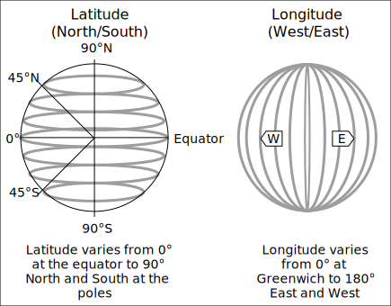
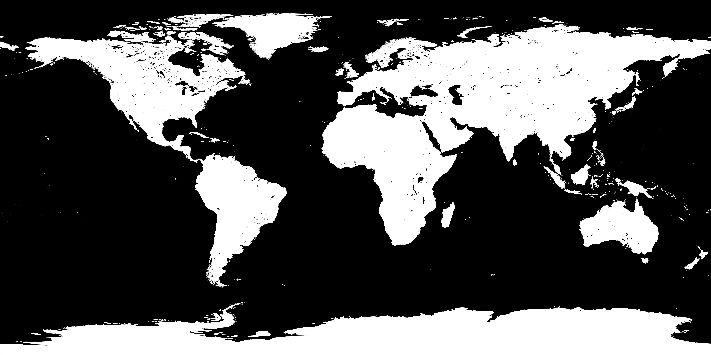

+++
title = "Bevy Procedural Earth Part 2: Coordinate Systems and Materials"
date = 2023-10-06
[taxonomies]
	tags = [ "Rust", "Bevy", "Gamedev", "Procedural Mesh" ]
+++



In part [one](@/posts/bevy_proc_earth_1.md) of this project, we went over the basics of mathematically constructing a mesh. At the end of it we were left with a segmented, but very boring grey sphere:


Obviously this is no fun, we want to get some textures on it. 

Now, there are lots of ways we could go about wrapping our texture, but I'm going to go about this in a somewhat unusual way. Since we are texturing a planet, and we have a lot of different maps with different projections to pick from, we are going to just select an appropriate one and calculate all our texture coordinates with latitude/longitude coordinates.

# Coordinate Systems Disambiguated

By the end of this article, we will have 3 different coordinate systems involved in procedurally generating our facsimile earth, they are:

### Bevy's Cartesian Coordinates 

These are the X, Y, Z triplet that identifies the location of the Entity in 3d space. There is [GlobalTransform](https://docs.rs/bevy/latest/bevy/transform/components/struct.GlobalTransform.html), which is the absolute position of the Entity relative to the origin `(0, 0, 0)`. And the [Transform](https://docs.rs/bevy/latest/bevy/transform/components/struct.Transform.html), which is the position of the Entity relative to its parent (or the origin, if it has no parent.)

This is the coordinate space that our individual vertices will exist in.

### UV (Texture) Coordinates

UV coordinates how flat textures are mapped onto the 3d surface of a mesh.


What U and V actually are, are a 2d coordinate system (usually from 0.0 to 1.0, but can also be by raw pixel count in some engines/apis.) We will assign each of our vertexes in 3d space onto this 2d coordinate system, and then the relevant segment of the 2d texture will be projected on each triangle that we generated in the last tutorial. 

### Geodetic Coordinates

Geodetic Coordinates are a pair of angles that describe the location of an object on the surface of a sphere. 



In reality, they aren't this simple. The objects we normally measure with Geodetic coordinates (such as earth) are not typically perfectly spherical. As a result of this (and computers), we have the wonderful field of GIS. (This has made a lot of software engineers very confused, and has been widely regarded as a bad move.) The variety of actual Geodetic systems, and their insanely large number of Datums (reference points from which spatial measurements are made) can make your head spin.

However, you can go far in the field of GIS by pretending that earth is a sphere ([which it definitely isn't](https://www.sciencedirect.com/topics/earth-and-planetary-sciences/oblate-spheroids)) and pretending all datums are WGS84 (or better yet, convert them). [^1] 

But for this project, it doesn't matter. We aren't optimizing for 10m accuracy, we just want a pretty earth.


## Converting from Cartesian to UV

Fortunately we have a somewhat direct method of converting between our Cartesian Coordinates and UV coordinates. In this example, we are going to use Geodetic Coordinates as a translation between them. 

Knowing that Positive longitudes are east of the Prime Meridian, negative west of the Prime Meridian, and Positive and Negative latitudes are north and south of the equator respectively, we can flatten these onto a 2d map with values that look like this:

```
       -180 (W)                   0                     180 (E)
        ┌────────────────────────────────────────────────┐
 +90 (N)│                                                │
        │                                                │
        │                                                │
        │                                                │
        │                                                │
  0     │                                                │
        │                                                │
        │                                                │
        │                                                │
        │                                                │
 -90 (S)└────────────────────────────────────────────────┘
```

Which is more or less how Mercator projection works.

All we need to do to convert a latitude/longitude pair to a position on our UV map. To do so, need to map the latitude and longitude from their normal ranges to 0.0 -> 1.0. Which is accomplished by this pair of functions:

```rust
fn map_latitude(lat: f32) -> Result<f32, CoordError> {
    // 90 -> 0 maps to 0.0 to 0.5
    // 0 -> -90 maps to 0.5 to 1.0
    // Ensure latitude is valid
    if !(-90.0..=90.0).contains(&lat) {
        return Err(CoordError {
            msg: "Invalid latitude: {lat:?}".to_string(),
        });
    }
    if (90.0..=0.0).contains(&lat) {
        Ok(map((90.0, 0.0), (0.0, 0.5), lat))
    } else {
        Ok(map((0.0, -90.0), (0.5, 1.0), lat))
    }
}

fn map_longitude(lon: f32) -> Result<f32, CoordError> {
    // -180 -> 0 maps to 0.0 to 0.5
    // 0 -> 180 maps to 0.5 to 1.0
    //Ensure longitude is valid
    if !(-180.0..=180.0).contains(&lon) {
        return Err(CoordError {
            msg: "Invalid longitude: {lon:?}".to_string(),
        });
    }
    if (-180.0..=0.0).contains(&lon) {
        Ok(map((-180.0, 0.0), (0.0, 0.5), lon))
    } else {
        Ok(map((0.0, 180.0), (0.5, 1.0), lon))
    }
}
```

Now, the last piece we need to make this coordinate conversion work is the ability to convert Cartesian Coordinates (x, y, z) to Geodetic ones (lat, lon). Assuming the point is normalized, getting these two angles is not difficult.

For latitude, we need to take the arcsine of the point of our "up" axis, which in bevy is positive Y. For longitude, we need the arctangent of our two "horizontal" axes, X and Z. In rust, that looks like:

```rust
let latitude = normalized_point.y.asin();
let longitude = normalized_point.x.atan2(normalized_point.z);
```

This quite easily gets our latitude and longitude in radians. Note that this strategy only works if the GlobalTransform of the sphere is precisely at the origin `(0, 0, 0)` of our scene. If you want this 
to work on spheres not at the origin of the scene (or for multiple different spheres) there will be a few extra steps involved.

I also want some easy ways to convert to degrees, since latitude and longitude aren't typically represented as radians. Fortunately this conversion is simple and not terribly lossy, so lets package all of this (as well as a few helper methods) up into a struct:

```rust
#[derive(Debug)]
pub struct Coordinates {
    // Stored internally in radians
    pub latitude: f32,
    pub longitude: f32,
}

impl From<Vec3> for Coordinates {
    fn from(value: Vec3) -> Self {
        let normalized_point = value.normalize();
        let latitude = normalized_point.y.asin();
        let longitude = normalized_point.x.atan2(normalized_point.z);
        Coordinates {
            latitude,
            longitude,
        }
    }
}

impl Coordinates {
    pub fn as_degrees(&self) -> (f32, f32) {
        let latitude = self.latitude * (180.0 / PI);
        let longitude = self.longitude * (180.0 / PI);
        (latitude, longitude)
    }

    pub fn convert_to_uv_mercator(&self) -> (f32, f32) {
        let (lat, lon) = self.as_degrees();
        let v = map_latitude(lat).unwrap();
        let u = map_longitude(lon).unwrap();
        (u, v)
    }

    #[allow(dead_code)]
    pub fn from_degrees(latitude: f32, longitude: f32) -> Result<Self, CoordError> {
        if !(-90.0..=90.0).contains(&latitude) {
            return Err(CoordError {
                msg: "Invalid latitude: {lat:?}".to_string(),
            });
        }
        if !(-180.0..=180.0).contains(&longitude) {
            return Err(CoordError {
                msg: "Invalid longitude: {lon:?}".to_string(),
            });
        }
        let latitude = latitude / (180.0 / PI);
        let longitude = longitude / (180.0 / PI);
        Ok(Coordinates {
            latitude,
            longitude,
        })
    }

    pub fn get_point_on_sphere(&self) -> Vec3 {
        let y = self.latitude.sin();
        let r = self.latitude.cos();
        let x = self.longitude.sin() * -r;
        let z = self.longitude.cos() * r;
        Vec3::new(x, y, z).normalize() * EARTH_RADIUS
    }
}
```

You might also notice that the `convert_to_uv_mercator` method calls the mapping functions we made earlier, allowing us to convert between latlon and UV just by calling this method on a point.

In addition, we have a method `get_point_on_sphere`:

```rust
pub fn get_point_on_sphere(&self) -> Vec3 {
    let y = self.latitude.sin();
    let r = self.latitude.cos();
    let x = self.longitude.sin() * -r;
    let z = self.longitude.cos() * r;
    Vec3::new(x, y, z).normalize() * EARTH_RADIUS
}
```

This allows us to convert in the other direction, and get a point on the sphere from Geodetic coordinates. This would be useful if you want to spawn an object at a given latlon.

## Setting UV Coordinates

Now that we have a means to get a UV coordinate for each vertex in our mesh, we need to actually assign them. So lets take a look at a new version of our `generate_face` function:

```rust
pub fn generate_face(
    normal: Vec3,
    resolution: u32,
    x_offset: f32,
    y_offset: f32,
) -> Mesh {
    let axis_a = Vec3::new(normal.y, normal.z, normal.x); // Horizontal
    let axis_b = axis_a.cross(normal); // Vertical
    let mut verticies: Vec<Vec3> = Vec::new();

// Create a new vec containing our uv coords
    let mut uvs = Vec::new();
	
    let mut indicies: Vec<u32> = Vec::new();
    let mut normals = Vec::new();
    let mut first_longitude = 0.0;
    for y in 0..(resolution) {
        for x in 0..(resolution) {
            let i = x + y * resolution;

            let percent = Vec2::new(x as f32, y as f32) / (resolution - 1) as f32;
            let point_on_unit_cube =
                normal + (percent.x - x_offset) * axis_a + (percent.y - y_offset) * axis_b;
	// Convert our point_coords into `Coordinates`
            let point_coords: Coordinates = point_on_unit_cube.normalize().into();
            let normalized_point = point_on_unit_cube.normalize() * EARTH_RADIUS;
            verticies.push(normalized_point);
	// Get the UV Coordinates of our point
            let (mut u, mut v) = point_coords.convert_to_uv_mercator();

	// Some special case logic
            if y == 0 && x == 0 {
                first_longitude = lon;
            }
	// In the middle latitudes, if we start on a 
	// negative longitude but then wind up crossing to a 
	// positive longitude, set u to 0.0 to prevent a seam
            if first_longitude < 0.0 && lon > 0.0 && lat < 89.0 && lat > -89.0 {
                u = 0.0;
            }
	// If we are below -40 degrees latitude and the tile 
	// starts at 180 degrees, set u to 0.0 to prevent a seam
            if x == 0 && lon == 180.0 && lat < -40.0 {
                u = 0.0;
            }
	// Push the UV Coordinates into the vec
            uvs.push([u, v]);
            normals.push(-point_on_unit_cube.normalize());

            if x != resolution - 1 && y != resolution - 1 {
                // First triangle
                indicies.push(i);
                indicies.push(i + resolution);
                indicies.push(i + resolution + 1);

                // Second triangle
                indicies.push(i);
                indicies.push(i + resolution + 1);
                indicies.push(i + 1);
            }
        }
    }
    let indicies = mesh::Indices::U32(indicies);
    let mut mesh = Mesh::new(PrimitiveTopology::TriangleList);
    mesh.set_indices(Some(indicies));
    mesh.insert_attribute(Mesh::ATTRIBUTE_POSITION, verticies);
    mesh.insert_attribute(Mesh::ATTRIBUTE_NORMAL, normals);
	// Insert the UV attribute along with our uv vec
    mesh.insert_attribute(Mesh::ATTRIBUTE_UV_0, uvs);
    mesh.generate_tangents().unwrap();
    mesh
}
```

You are probably wondering what is up with this bit specifically:

```rust
	// Some special case logic
            if y == 0 && x == 0 {
                first_longitude = lon;
            }
	// In the middle latitudes, if we start on a 
	// negative longitude but then wind up crossing to a 
	// positive longitude, set u to 0.0 to prevent a seam
            if first_longitude < 0.0 && lon > 0.0 && lat < 89.0 && lat > -89.0 {
                u = 0.0;
            }
	// If we are below -40 degrees latitude and the tile 
	// starts at 180 degrees, set u to 0.0 to prevent a seam
            if x == 0 && lon == 180.0 && lat < -40.0 {
                u = 0.0;
            }
```

This is a section that is needed to prevent seams where the UV coordinates go in the wrong direction. Since the coordinates near the prime meridian go from 
1 to 0 in the space of one vertex, the entire texture is re-projected backwards on the faces leading up to the prime meridian. There are a few ways to fix this, namely offsetting
your vertexes so that they are *exactly* aligned with the prime meridian, but I decided to just clamp the values close to both the prime meridian and the poles to prevent the seams from occurring.

And, just to test that everything is working properly, lets go ahead and assign it an [uv test texture](https://www.google.com/search?client=firefox-b-1-d&q=uv+test+texture) of your choice.

```rust
pub fn generate_faces(
    mut commands: Commands,
    mut meshes: ResMut<Assets<Mesh>>,
    mut materials: ResMut<Assets<StandardMaterial>>,
    asset_server: Res<AssetServer>,
) {
    let faces = vec![
        Vec3::X,
        Vec3::NEG_X,
        Vec3::Y,
        Vec3::NEG_Y,
        Vec3::Z,
        Vec3::NEG_Z,
    ];

    let offsets = vec![(0.0, 0.0), (0.0, 1.0), (1.0, 0.0), (1.0, 1.0)];

    let mut rng = rand::thread_rng();

    for direction in faces {
        for offset in &offsets {
            commands.spawn((
                PbrBundle {
                    mesh: meshes.add(generate_face(direction, 100, offset.0, offset.1)),
                    material: materials.add(StandardMaterial {
                        base_color_texture: Some(
                            asset_server.load("WorldTextures/uv_test_texture.png"),
                        ),
                        ..default()
                    }),
                    ..default()
                },
                PickableBundle::default(), // Makes the entity pickable
                RaycastPickTarget::default(),
                On::<Pointer<Click>>::run(|event: Listener<Pointer<Click>>| {
                    info!("Clicked on entity {:?}", event);
                    let hit = event.hit;
                    if let Some(pos) = hit.position {
                        let coords: Coordinates = pos.into();
                        let (latitude, longitude) = coords.as_degrees();
                        info!(
                            "Latlon of selected point: Lat: {}, Lon: {}",
                            latitude, longitude
                        );
                    }
                }),
            ));
        }
    }
}
```

While we were messing with that function, I also used the wonderful [bevy picking module](https://github.com/aevyrie/bevy_mod_picking) to give us a chance to look at/debug our coordinate generation if it isn't working correctly. Now when you click on the sphere, you should get a log message emitted with the latitude and longitude coordinates.

So, lets fire it up and see what happens:

<video controls width=100%>
<source src="../../videos/sphere.webm" />
</video>

Which looks pretty good!

And when you click on the globe, you get this lovely log message:
```
2023-10-20T19:14:05.861205Z  INFO surface_action::map: Latlon of selected point: Lat: 29.734213, Lon: -95.40474
```

So now that all of that is out of the way, lets make it look like an actual earth.

## Textures

Head over to [Visible Earth](https://visibleearth.nasa.gov/collection/1484/blue-marble?page=2) and download the texture package for the month of your choice. Use the highest resolution one if possible for maximum pretty. But if you get a WGPU error when compiling, try a lower resolution (you may also have to resample them in GIMP or another program if you are running on a computer without a discrete GPU.)

It should look something like this:


Next, we will add a metallic roughness texture. This may be a bit confusing, because we aren't creating a metallic object, but we are going to use this channel to differentiate between the reflectivity of land versus the ocean. As a result, I've taken one of NASAs specular maps and inverted it (you can download and invert it yourself from NASAs website, or just save the image below):



And finally for our normal channel, we have a 21k resolution topography map.


Since these images all use the same projection, the same UV coordinates will suffice for all of them. As a result, the only thing left to do is add them to our PBR material in the `generate_faces` function:

```rust
PbrBundle {
	mesh: meshes.add(generate_face(direction, 800, offset.0, offset.1, &rs)),
	material: materials.add(StandardMaterial {
		base_color_texture: Some(
			asset_server.load("WorldTextures/world_shaded_32k.png"),
		),
		metallic_roughness_texture: Some(
			asset_server.load("WorldTextures/specular_map_inverted_8k.png"),
		),
		perceptual_roughness: 1.0,
		normal_map_texture: Some(
			asset_server.load("WorldTextures/topography_21K.png"),
		),
		..default()
	}),
	..default()
},
```

And the results should be a textured Earth:

<video controls width=100%>
<source src="../../videos/spinny_earth.webm" />
</video>

Next time we are going to use some GIS real world elevation data to deform the mesh into an exaggerated height model of the earth.

[^1]: Please don't actually do this if you are going into a GIS career though.