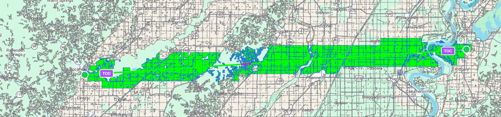
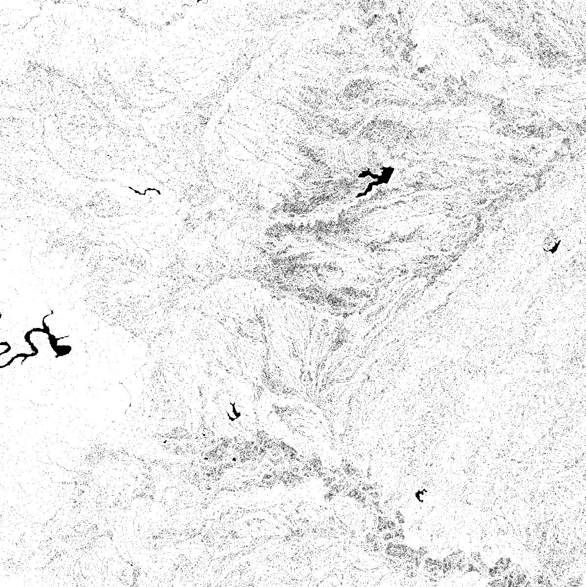
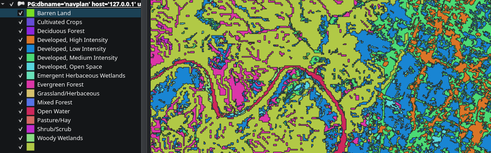
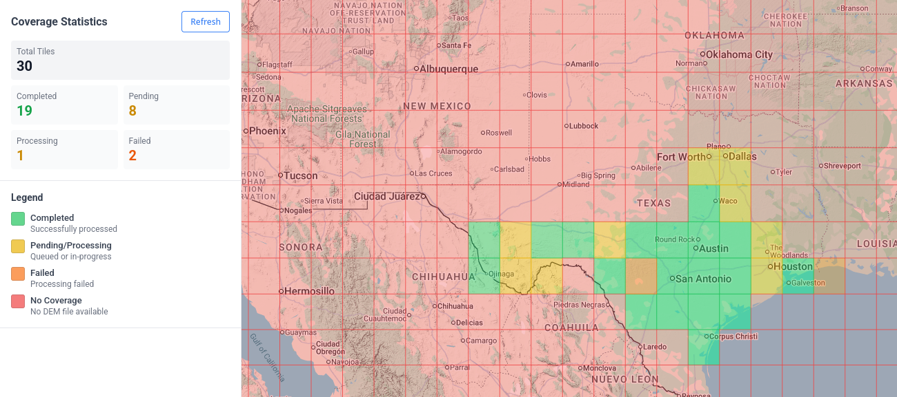
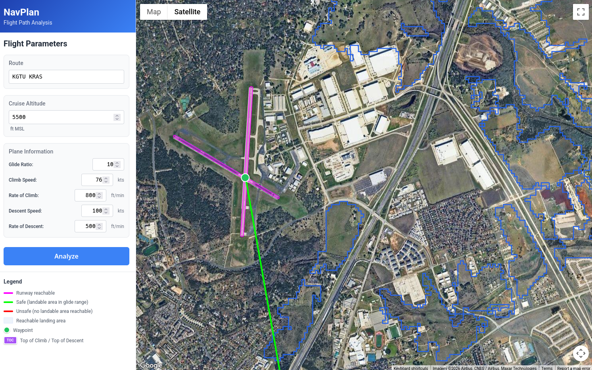
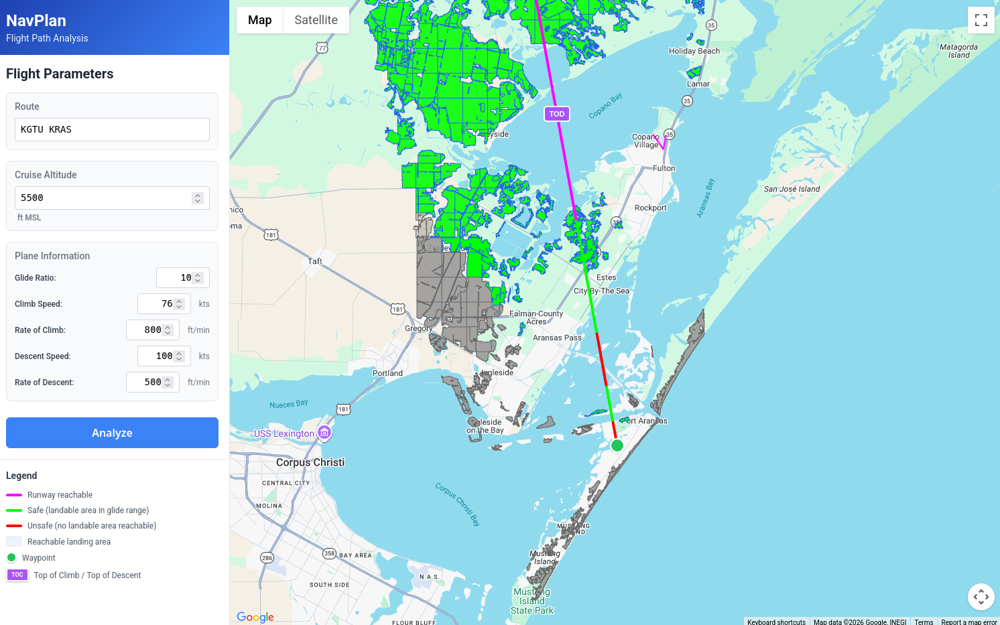
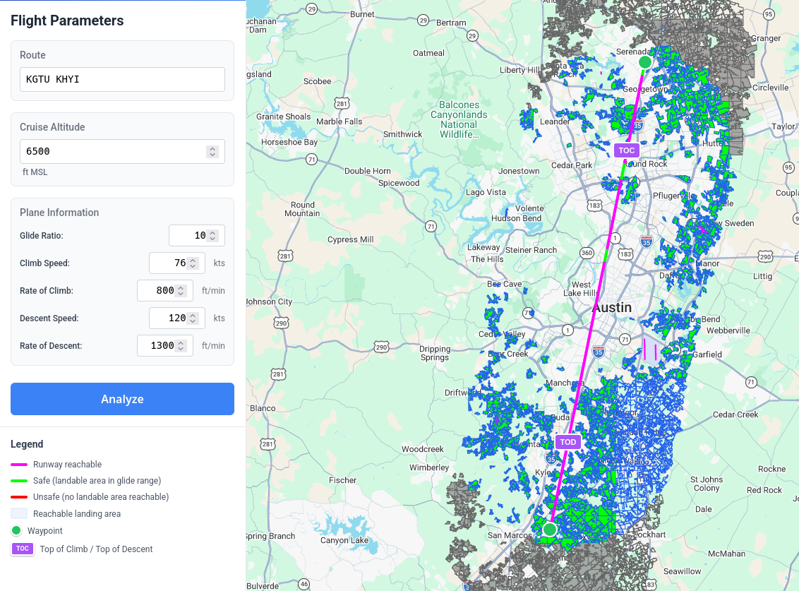
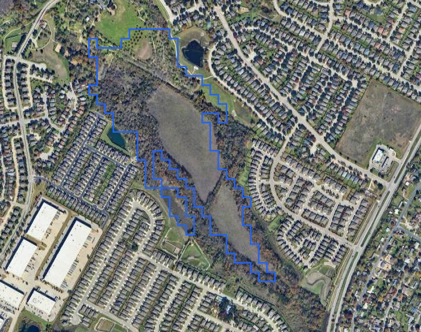
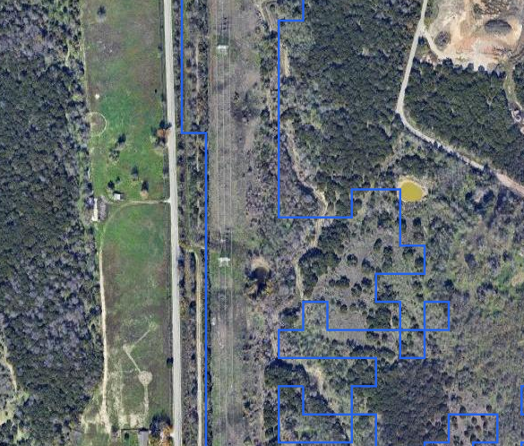

+++
title = "Mapping Tomorrow's Crash Sites Today"

date = 2026-02-04

draft = false

[taxonomies]
	tags = ["Rust", "Typescript", "Webapp", "Aviation"]
+++




In the case of engine failure, how screwed are you?

As of the time of writing, most of my flight experience has been over a particularly flat part of central Texas. Even better, there are a bunch of nice farmers around to maintain emergency runways (though, annoyingly, they do tend to plant crops on them). Doing simulated engine failures and fires over our practice area is pretty hard to mess up. Just point the aircraft in a random direction, and chances are there will be a large flat field there.


But, heading back towards our home airport (KGTU), that quickly changes as you cross I-35 and descend to pattern altitude. What was fields only a few miles ago is now densely wooded areas, neighborhoods, and warehouses. At pattern altitude, you have *some* options. But taking off from all but one runway, the only realistic options you have below turnback altitude are trying to get to I-35 and its associated medians and clearings (which you probably won't), or landing in the treetops.

# A Brief Aside: Crash Survivability

This is a post about an interesting experiment I did with GIS data, not about aviation safety. But since the subject matter involves forced landings, I think a small PSA is in order. 

A few years ago, a small plane experienced an engine failure a ways out from KGTU, and landed short of the runway, into a house:


You might be surprised to learn that the three occupants of this plane survived, sustaining reasonably minor, non-life-threatening injuries. And this illustrates an important point: if you do happen to find yourself in a bad situation where no well manicured perfectly level fields are available, you are far from dead.

Forced landings in inhospitable environments (rough terrain, trees, etc.) are quite survivable *when executed properly*. Some sources would put the rate of survival somewhere in the 90-97% range [^1], which is similar to the survival rate of ditching in water. But ditching in treetops or other inhospitable environments does carry a significant chance of injury. To make things simple, you can assume the chances of a moderate to serious injury when landing in a dense wooded area are probably about 50/50.

Single-engine aircraft stall at low speeds by design, which means lower impact energy when you hit the ground. Certification standards used to mandate low stall speeds for this reason, though these requirements were revised around 2017. This characteristic, combined with structural requirements[^6] for withstanding abrupt deceleration, means you can land into or onto quite a lot of things with a reasonable chance of survival. Just don't stall and spin. If you lose control and enter a spin, you're likely hitting the ground at 100 knots or more instead of a controlled 50 knots. Get as slow as you can without stalling, and in the words of Bob Hoover, fly the plane as far into the crash as you can. Do this, and your odds of survival are pretty good.

But it is probably going to hurt.

Aircraft engines are surprisingly reliable. So long as you are aware of the risks, and know what needs to be done to survive, I wouldn't judge those who chose to fly over inhospitable terrain in single engine aircraft. After all, you could make an argument that a sizeable portion of Alaska's transportation infrastructure is just that.

But there are also plenty of ways to manage this risk. I liked to take a gander in Google Earth and see what was around the airports I fly between to see if there is cause for concern. And for the most part I was just looking for areas with flat land, with no trees or structures. And what follows is really just a stream-lined version of that.

After smashing together a few different publicly available data-sets, I wound up with what I think is a fairly accurate guess of *safer* forced landing options. And while I was at it, I made a tool to query this data (and it has a few other neat tricks too).


# GIS Data Sources

First, we need elevation data. I'm using the [SRTMv3](https://www.earthdata.nasa.gov/data/alerts-outages/shuttle-radar-topography-mission-version-3-0-srtm-plus-product-release) dataset. For those who don't know, most of the data in this set came from a really neat space shuttle mission, STS-99, on the Space Shuttle Endeavour. The data was generated via an interferometric synthetic aperture radar attached to the shuttle. 

The dataset is available in 3 arcsecond (about 30 meters) or 1 arcsecond (about 10 meters). I'm using the 1 arcsecond DEM simply because I already have it downloaded for another project.

The second dataset we need is the [National Land Cover Database](https://www.usgs.gov/centers/eros/science/national-land-cover-database) (NLCD). The NLCD covers the contiguous United States, and provides land cover information at a fairly high resolution.

The NLCD classifies land cover into a number of classes:
- Open Water
- Perennial Ice & Snow
- Developed
	- Open Space
	- Low Intensity
	- Medium Intensity
	- High Intensity
- Barren Land
- Forest
	- Deciduous
	- Evergreen
	- Mixed
- Shrub/Scrub
- Grassland/Herbaceous
- Pasture/Hay
- Cultivated Crops
- Woody Wetlands
- Emergent Herbaceous Wetlands

This gets us a long way towards our goal, as we can eliminate a lot of options that typically don't make good landing sites (Developed land, Forests, Wetlands). And also, to an extent, prioritize the better options. i.e., Cultivated Crops -> Pasture/Grassland -> Barren. 

Lastly, I needed data on airports and navaids. This comes from [ourairports.com](https://ourairports.com/data/). This is, frankly, not the best dataset. It is by far the easiest to use, but there were a lot of inaccuracies for airports near me (I did make an account and correct the ones I knew about, but I'm sure there are more).

I'd love to eventually integrate a more official source, like the FAA ADIP API (assuming I can figure out how to even get access to it).

# The Pipeline

We have a few goals with our processing pipeline:

We want to find runway-like surfaces. These are surfaces that are flat and free from obstruction. The data we have so far can't guarantee that we will find surfaces free from obstruction, but based on land cover classification, they can give us a decent guess. Part of the goal here is an interactive briefing tool that will allow pilots to inspect potential landing areas, and streamline the process, so this isn't necessarily a problem. Plus, I'm sure I'll think of other ways to further refine this dataset in the future.

So let's focus on the first objective: finding flat areas.

The SRTM dataset is divided into 1°x1° tiles, so these will be our unit of work. I wrote a `pipeline-runner` binary in rust that will perform each processing step on a per-tile basis. This pipeline writes to various PostGIS tables that represent each step of data refinement, and this allows us to use a lot of native PostGIS functions (which are highly optimized) to help us process our data more easily. We also use Rust [GDAL](https://gdal.org/en/stable/) bindings for certain steps as well.

A very easy data source to work with is a raster Digital Elevation Model (DEM). These are usually `.tif` files (such as in the case of the SRTM3 dataset), though they can really be in any image format (since they are a simple raster). The point is, the band value (usually there is only one band in a DEM, since they usually only encode elevation) corresponds to elevation (and the metadata will help you derive the actual elevation from this value). Here is a render of a DEM .tif from a sampled version of the SRTM3 dataset, centered around Austin, Texas:


In this rendering, darker areas are lower altitudes, and lighter areas are higher altitudes. One easy thing about working with the SRTM3 data is that the datum is the EGM96 geoid, which approximates Mean Sea level. We would need to be careful if we were working with a dataset using the WGS84 ellipsoid as a datum, as we would need to correct each altitude. Fortunately, aviation charts and such are already using MSL and as such we are in the same conceptual space for altitudes without any conversions (besides feet to meters). For more information on the difference between Ellipsoid and Geoid datums, ESRI has a good explanation [here](https://www.esri.com/about/newsroom/arcuser/mean-sea-level-gps-geoid).

Now we are going to reference this same DEM a few steps down the road, but for now what we care about is finding areas with unacceptable slopes. I picked 8% grade as the rough level of slope I want to exclude (it's configurable, and I'm not sure this is the correct number, but it was a good place to start). I tried this a few different ways, but the way that worked best from a performance standpoint was to take each DEM tile and turn it into an exclusion mask, by comparing adjacent pixels in the raster and figuring out if their slope was greater than 8%. 

To get this, we first need to turn the raster of elevations into an raster of slopes:

```rust
/// Generate a slope raster from a DEM using gdaldem
fn generate_slope_raster<P: AsRef<Path>, Q: AsRef<Path>>(
    dem_path: P,
    output_path: Q,
) -> Result<()> {
    log::info!("Generating slope raster...");

    let output = Command::new("gdaldem")
        .arg("slope")
        .arg(dem_path.as_ref())
        .arg(output_path.as_ref())
        .arg("-p") // Output as percentage
        .arg("-compute_edges")
        .arg("-of").arg("GTiff")
        .output()
        .context("Failed to execute gdaldem")?;

    if !output.status.success() {
        let stderr = String::from_utf8_lossy(&output.stderr);
        anyhow::bail!("gdaldem slope failed: {}", stderr);
    }

    log::info!("Slope raster generated: {:?}", output_path.as_ref());
    Ok(())
}
```

Then we turn this into a binary mask where 1 are "acceptable areas" with slopes < threshold, and 0 otherwise:

```rust
/// Create a binary slope mask (1 where slope < threshold, 0 otherwise)
fn create_slope_mask<P: AsRef<Path>, Q: AsRef<Path>>(
    slope_path: P,
    output_path: Q,
    max_slope_percent: f64,
) -> Result<()> {
    log::info!("Creating slope mask (threshold: {}%)...", max_slope_percent);

    // Use gdal_calc.py to create binary mask
    // Result is 1 where slope < threshold, 0 otherwise
    let calc_expr = format!("(A<{}).astype(numpy.uint8)", max_slope_percent);

    let output = Command::new("gdal_calc.py")
        .arg("-A").arg(slope_path.as_ref())
        .arg(format!("--outfile={}", output_path.as_ref().display()))
        .arg(format!("--calc={}", calc_expr))
        .arg("--type=Byte")
        .arg("--NoDataValue=0")
        .arg("--quiet")
        .arg("--overwrite")
        .output()
        .context("Failed to execute gdal_calc.py")?;

    if !output.status.success() {
        let stderr = String::from_utf8_lossy(&output.stderr);
        anyhow::bail!("gdal_calc.py mask creation failed: {}", stderr);
    }

    log::info!("Slope mask created: {:?}", output_path.as_ref());
    Ok(())
}
```

What you wind up with, is something that looks like this:



This gives us a very efficient way to exclude areas from the next step while we are still working with rasters.

So we've taken care of flat, now we need to move on to the next thing: ground cover.

To start, we're going to take the NLCD (which is also a raster) and multiply it by our mask. Since any value with an unacceptable slope will be a "0" value in the mask, those areas will be effectively eliminated from the NLCD raster:

```rust
/// Apply mask to raster (multiply raster by mask)
fn apply_mask_to_raster<P: AsRef<Path>, Q: AsRef<Path>, R: AsRef<Path>>(
    raster_path: P,
    mask_path: Q,
    output_path: R,
) -> Result<()> {
    log::info!("Applying mask to NLCD...");

    // Use gdal_calc.py to multiply raster by mask
    // Where mask is 0 (steep slope), result will be 0 (NoData for NLCD)
    let output = Command::new("gdal_calc.py")
        .arg("-A").arg(raster_path.as_ref())
        .arg("-B").arg(mask_path.as_ref())
        .arg(format!("--outfile={}", output_path.as_ref().display()))
        .arg("--calc=A*B")
        .arg("--type=Byte")
        .arg("--NoDataValue=0")
        .arg("--quiet")
        .arg("--overwrite")
        .output()
        .context("Failed to execute gdal_calc.py")?;

    if !output.status.success() {
        let stderr = String::from_utf8_lossy(&output.stderr);
        anyhow::bail!("gdal_calc.py mask application failed: {}", stderr);
    }

    log::info!("Mask applied: {:?}", output_path.as_ref());
    Ok(())
}
```


Now what we have is an NLCD raster with empty areas where the slope was too great. But to serve this efficiently to clients, we should deliver this data as individual polygons in GeoJSON as opposed to an image. This would allow us to preserve the accuracy of the dataset while also optimizing how we query and further refine it.

I'm going to gloss over this next part—apologies in advance. To put it simply, I'm using the `GDALPolygonize` FFI from the [gdal_sys](https://docs.rs/gdal-sys/0.12.0/gdal_sys/) crate, but there is a lot more to it than that unfortunately and I'm not going to unpack it here. The good news is, you can get a decent result just by running the function on a raster. But if you want to optimize the resultant geometries for easy querying/spatial indexing/processing, you are going to spend a lot of time figuring out sieve filters and subdividing large contiguous blocks of land when appropriate. None of it is hard, but it is a bit tedious and requires a lot of experimentation. 

But what I eventually wound up with, was an NLCD vector that looks somewhat like this:



Now we need to figure out the dimensions of our newly generated vectors. Specifically, we are looking for at least a 2500ft long 50ft wide path contained within each vector for it to qualify as a potentially landable area.

To do this, we are going to sample 200 points along the perimeter of the polygon, and check each pair to see if:
- It is longer than the minimum candidate distance (currently 2500 feet, but configurable)
- It is longer than the best one we've already found
- Verify that the entire length of the segment is entirely contained within the geometry of the polygon

```rust
/// Find the longest line segment entirely contained within a single polygon
fn find_longest_interior_segment(
    polygon: &Polygon<f64>,
    min_width_degrees: f64,
) -> Result<Option<(LineString<f64>, f64)>> {
    // Sample points along the polygon boundary
    let boundary_points = sample_boundary_points(polygon, BOUNDARY_SAMPLES)?;

    if boundary_points.len() < 2 {
        return Ok(None);
    }

    let mut best_segment: Option<LineString<f64>> = None;
    let mut best_length = 0.0;

    // Check all pairs of boundary points
    for (i, p1) in boundary_points.iter().enumerate() {
        for p2 in boundary_points.iter().skip(i + 1) {
            // Skip points that are too close together
            let pair_distance = distance(p1, p2);
            if pair_distance < MIN_CANDIDATE_DISTANCE {
                continue;
            }

            // Skip if this pair can't possibly beat our best
            if pair_distance <= best_length {
                continue;
            }

            // Create line segment between these boundary points
            let segment = LineString::from(vec![*p1, *p2]);

            // Check if the segment is entirely within the polygon
            // We use a sampling approach since geo's Contains can be strict
            if is_segment_inside_polygon(&segment, polygon) {
                let length = segment.euclidean_length();
                if length > best_length {
                    // Check width requirement by verifying perpendicular clearance
                    if check_width_requirement(&segment, polygon, min_width_degrees) {
                        best_length = length;
                        best_segment = Some(segment);
                    }
                }
            }
        }
    }

    Ok(best_segment.map(|s| (s, best_length)))
}
```

And we can query the intermediate table with QGIS to see the output of this step:


This is, unfortunately, O(N²) at best. I had considered doing a rotating caliper or indexing by antipodals, but this would only work for mostly square shaped polygons. The current sampling plus brute force method handles shapes with holes in their internal geometry fairly well. And I'm not sure either of the other options would be as good:


Moreover, I don't mind spending the extra CPU cycles on this pipeline, because it will only be re-run whenever I change something about it, or when the datasets update (at most, annually). So it's really good enough as is, and the tradeoff is well worth it.


When zoomed out, these segments create an interesting visualization that represents how contiguous the land cover areas are. Areas with more segments have more varied land cover, while long segments indicate areas of contiguous land cover.

For instance, here is a portion of the Texas gulf coast[^2]:


For those curious, the large area devoid of any landable segments in the top left of the map are the heavily urban parts of San Antonio.

As previously mentioned, the unit of work is a 1x1 degree DEM raster, so we can iterate through this pipeline in small chunks. I've picked Texas as a test area (mostly because I'm familiar with the local geography). The dashboard below shows the progress of each tile's pipeline:



And I'll go more into how the frontend works another day, but here is what the current (very primitive) interface looks like:


We have a place to enter a route string (it isn't correctly parsing all routes yet, but if your route only includes airfields and navaids in the Ourairports dataset, it should work fine). The line is rendered from the departure airport to the destination airport and is colored as so:
- Magenta, if you can glide to a runway
- Green, if you can glide to a landable_area [^3]
- Red, if you can't glide to any landable_area


Additionally, we are rendering an overlay of the actual landable areas. Green ones are ones we can reach at some point on our journey, Grey ones are out of range, but shown for context (i.e. you might choose to cruise at a higher altitude to reach a landing area farther away). 

But most importantly, this tool makes it easy to find areas where landable areas are sparse, and then visually check satellite imagery to see if they are viable or not[^4]:



And, in this case at least, it does a pretty good job of highlighting areas that are viable in an otherwise urban/forested area. You will notice that there are some fields that aren't highlighted, but remember, we are rejecting any area without a 2500x50ft flat area.

Looking at the arrival area, we can see an area of the flight where we would not be able to glide to any options, as we cross the Gulf Intracoastal Waterway:



And the tool allows us to play some "what if" scenarios. In the original plan we had a pretty lazy 500fpm descent, what if we increase that to 800fpm? Sure enough, this gets rid of this period of risk and we can now glide to several options even as we are in the middle of the waterway.


You will notice there is a small red segment right as we get to the airport, this is there for several reasons. One, we don't assume that we arrive at the airport at pattern altitude to fly a pattern. I plan on eventually adding pattern entry logic to the [Pattern Visualizer](https://pattern-visualizer.graysonhead.net), and that logic will eventually make its way into this app as well.

Second, we are cheating a bit with how we calculate what we can glide to. For the purposes of making the app more performant, we are including a landing area only if we can glide to the centroid of that area. For landing areas, this is conservative, and fine. But with Runways which are long and skinny, we really only care if we can hit the threshold (since we know for sure that runways are usually pretty good places to land). 

It's also useful for answering a question I like to ask before I do my night cross-country: What is the minimum altitude at which you can fly a given route and always (or at least mostly) be in range of a runway?

In the case of a flight between KGTU and KHYI, 6,500 feet leaves you at risk for only two short segments[^5].




# Problems and Future Improvements

This is obviously imperfect, and by no means done. Some areas we consider landable right now are terrible options. For instance, just looking around Austin:

We have a forest, which is misclassified as a field:


A lot of perfectly good fields are bisected by a line of trees:



In this case, either of the fields would probably make an acceptable forced landing site. But it would be nice if we could post-analyze each tile and see if the landable segment crosses any interesting objects. I'm curious if I could use something like tensorflow to process the satellite imagery for each segment and see if the imagery shows obstructions that don't show up in the NLCD dataset.

And here, we have a very long perfectly runway shaped field, but unfortunately this field is cleared because its occupied by high voltage power lines.



This is a partially solvable problem, as there are several datasets that can be combined to create linesegments for most high voltage power lines in the contiguous US. We could do something similar to (or combined with) our slope mask earlier. Take these vectors, convert them to a true/false raster (adding some buffer depending on the height of the towers), and then use that as an additional mask (or merge it with the existing one). It won't get all power lines, but it should get most of the big ones.

Additionally, the one huge thing that is missing here is winds. A lot of the existing code was designed with winds in mind, but I'm honestly not sure how I want to implement that yet.

# Closing

This tool won't tell you whether a field is safe to land in. Only your eyes and judgment can do that. What it *can* do is highlight where your options thin out, so you know where to look more carefully during preflight planning. And it can answer questions that would be tedious to answer manually, like what altitude you need to maintain to stay within gliding range of a runway.

The datasets here are massive (the SRTM and NLCD data cover the entire continental US at high resolution), which made the pipeline work particularly satisfying. There's something deeply appealing about turning gigabytes of elevation and land cover data into actionable flight planning information.

This is very much a work in progress. The power line masking needs implementation, the classification accuracy could improve with some ML-based satellite imagery analysis, and wind calculations remain an open question. And I haven't even looked into the practicality of using LIDAR data in urban areas (it turns out, there are a lot of public lidar datasets). I'll likely revisit this project as I refine the algorithms and expand coverage.

I'd like to eventually host this somewhere publicly accessible, but I haven't worked out how to do that without it becoming a money pit. The infrastructure itself is straightforward—PostGIS database, API server, caching layer—but serving vector tiles for the entire continental US to an unknown number of users means either paying for capacity I don't need most days, or getting surprised by a bill when someone posts it on Reddit. For now, I'm focused on getting the data pipeline and algorithms right. Deployment can wait until I figure out sustainable hosting.

<br>
<br>
<br>
<br>

[^1]: https://aviationsafetymagazine.com/features/water-or-trees/

[^6]: https://www.ecfr.gov/current/title-14/chapter-I/subchapter-C/part-23/subpart-C/subject-group-ECFR72b1233739a7fce/section-23.2270

[^2]: You will also notice that there is a max size for contiguous chunks of land of about 2x2km. These smaller chunks of land are just easier to work with, and the subdivision is more or less a thin wrapper around the PostGIS ST_SUBDIVIDE function, so I'm glossing over it.

[^3]: Calling these landable_areas to the user is not a good idea, but "suspected landable area" doesn't quite roll off the tongue. I'm not sure what to call them, but that is a problem for future Grayson

[^4]: Obviously the satellite imagery could be out of date, but the only way you are gonna fix that is to go fly over it yourself, at which point you've already accepted the risk anyways.

[^5]: One of the fields providing this coverage is private and probably not lit, but that could be filtered out with a better airport datasource. And also, as yet another reminder, this doesn't take winds into account at all yet.