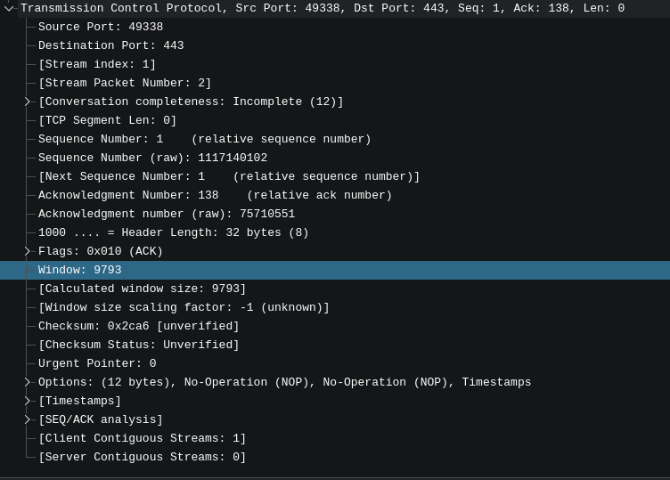
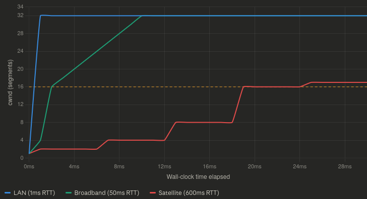
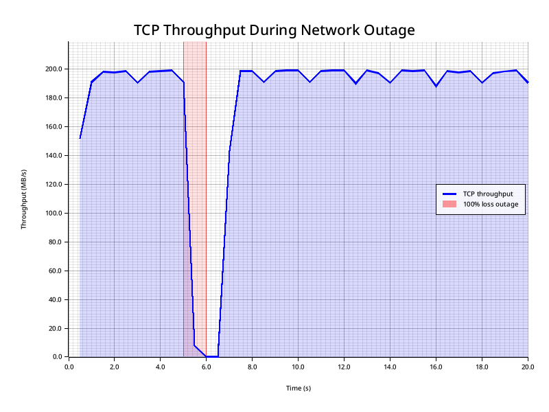
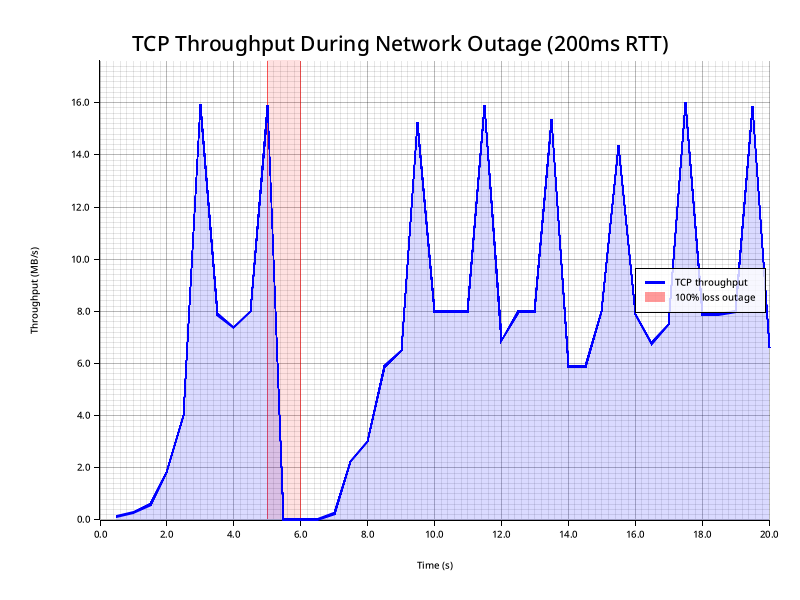
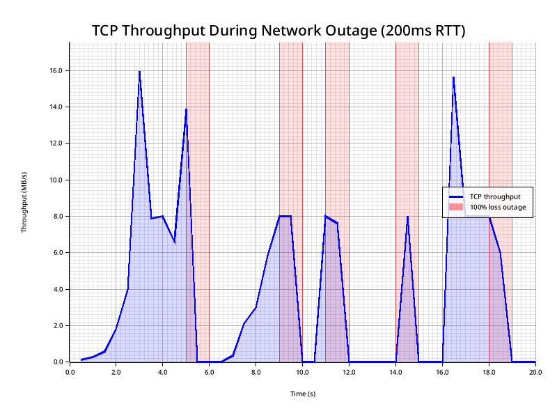
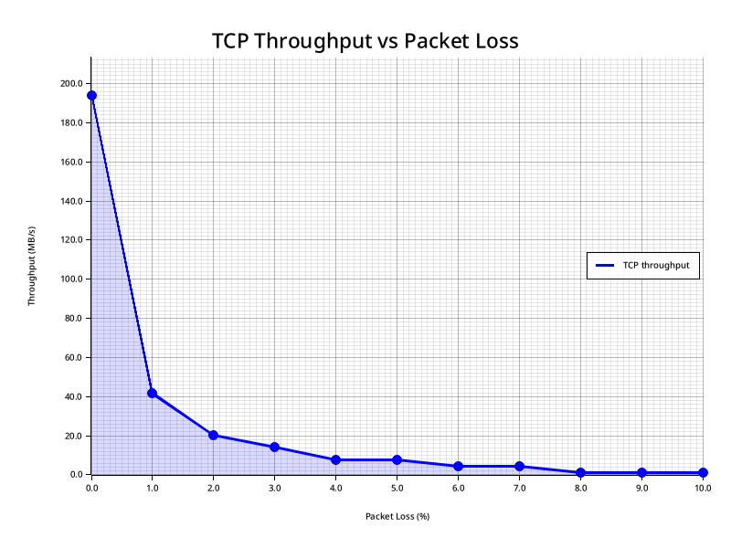
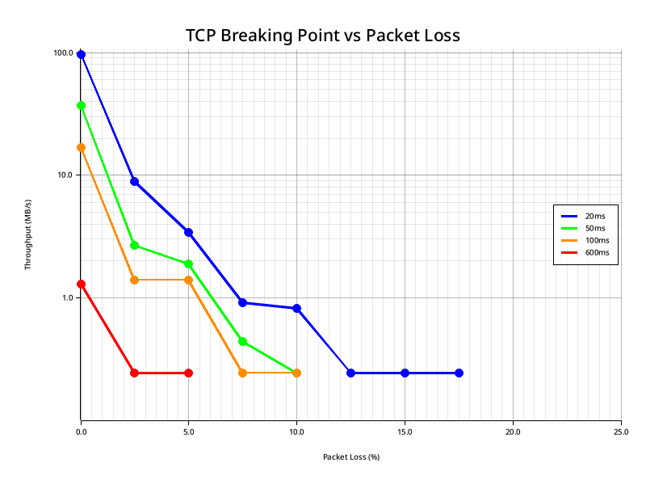
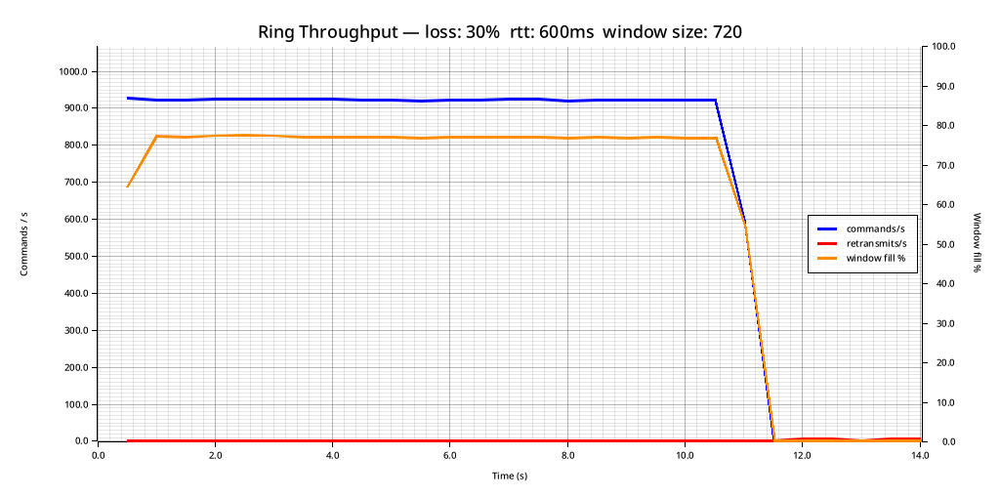
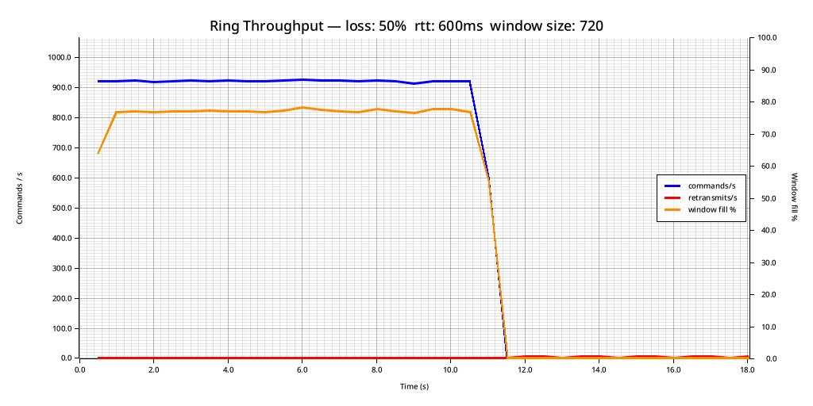
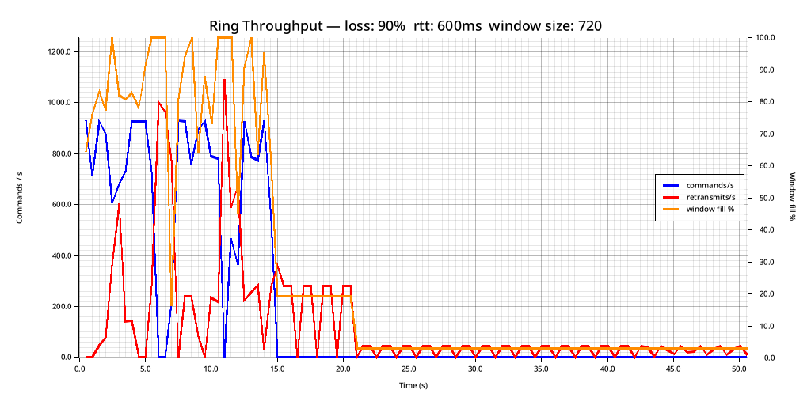

+++
title = "Reliable Delivery Over Horrible Networks"
date = 2026-03-26
[taxonomies]
	tags = [ "Networking", "Rust", "netcode" ]
+++

TCP is a cornerstone of the internet for good reason: it works very well in most situations. One of the reasons it is so effective is because of how it handles dealing with congestion. Congestion control algorithms are like a bouncer at a packed venue. When things are backed up inside, nobody new gets in. When there's room, the line starts moving again.

And as far as TCP is concerned, the best signal for congestion is lost segments [^1] (segments being the individual unit of data that gets wrapped in an ethernet frame [^2]). But loss isn't always congestion. Sometimes loss is switching cell towers. Sometimes loss is because you are right on the edge of the effective range of a radio link. Sometimes loss is adversarial interference.

At a certain percentage of loss, you won't be able to deliver any data via TCP at all.

So let's say you are building a network stack for unmanned vehicles that might operate in environments with adversarial jamming. How can you be sure you can deliver a critical message to them in the case of an emergency?

As we will soon discover, it depends.

## Latency Sucks

The two prime guarantees of TCP are:

- Reliable Delivery (your byte stream will make it to the other side)
- Ordered (your byte stream will arrive in the same order you sent it)

And solving these two guarantees efficiently drives much of the design of TCP. And the key to understanding this (and often, to troubleshooting TCP issues) are the "windows" that regulate the flow of data between nodes.

The reason this matters for us: those windows are a feedback system, and feedback systems are sensitive to latency. On a lossy, high-latency link, that sensitivity becomes TCP's biggest weakness.

In an ideal world, the sender would send data as fast as it possibly can, the network would dutifully transport all this data at exactly the rate the sender is sending it, and then the receiver will receive and process the data exactly as fast as the sender sends it. However, in practice, this almost never happens. What if the receiver is an overloaded webserver that is processing data from a million other clients? What if the network is congested? At some point, the sender must slow down. Windows regulate the amount of data that is allowed to be in-flight between clients at any time. They represent the gas pedal that is pressed when all is well and the data is flowing as fast as possible, as well as the brake that gets pushed if the receiver stalls, or the network quality degrades.

The first window is the Send window. This is maintained by the sender. The purpose of this window is to hold the Bandwidth Delay Product (BDP) of the connection. You can figure out what the BDP is with some simple math. Simply multiply the rate of transmission in bytes by the latency in seconds: 

`( BDP = bandwidth * rtt)`. 

For example, if your application can saturate a 10Gbps NIC and you are sending data to a host 10ms from you, your BDP is `10 Gigabits/s * .01`. Which works out to around 12.5 Megabytes. In theory, if all you were doing was sending data from one machine to one client, you could set your send buffer [^3] to this exact value and never need to adjust it. But in practice, this window (as well as all the others) are subject to algorithms that constantly increase and decrease their size to accommodate changing conditions.

So when we send data, data gets put into this buffer. But why don't we forget it? Why does it still stick around after sending? That is because we need to know the other side received it before it can be discarded. We need delivery to be reliable. Once the other side sends us an ACK for that specific segment, then we can drop that specific data from the send buffer and free up room to send more data, but until this happens, the sending side must retain it for possible retransmission. So in addition to being a throttling mechanism, the send buffer can also be a cache for retransmission. To put it simply, the buffer derived from the send window is what allows us to guarantee that the data is both reliably delivered, and ordered.

Next, we have the Receive window. This window regulates how quickly the host on the receiving side of the connection is actually consuming data. Each ack sent by a receiver will contain a `rwnd` value that indicates how much room is left in the window, and the Sender should not send additional data to the Receiver if it exceeds this value (even if the Sender's send buffer is not full). This allows the receiving host to add backpressure to the system to slow down the propagation of data through a network if it cannot keep up with the rate at which data is being sent.

As an aside, this value is extremely valuable when troubleshooting issues with live applications, you can see it here in wireshark:


And finally, we have the congestion window. The congestion window's job is to provide backpressure when the network itself starts introducing problems. In practice, it does the same job as the receive window, but for different reasons. It is adjusted by the operating system based on the measured quality of the connection.

These three windows decide how much data you can send over a TCP connection at any given moment. For instance, if:

- `cwnd` = 64KiB
- `rwnd` = 48KiB
- bytes in flight = 30KiB

Then you can send `min(64, 48) - 30 = 18KiB` right now.

So, now that we understand some of the basics, why does latency make this worse?

Remember that on most systems, these window sizes are auto-tuned by the system. In fact, the backpressure and congestion control systems of TCP depend on their size being dynamic. The SEND -> ACK process allows each side of the conversation to discover things about the state of the sender, receiver, and connection between them. But, the quickest they can possibly discover this information is one round trip time *after* those changes occur. It's a feedback system. And the higher the RTT, the slower the feedback, for both positive (link is underutilized) and negative (high packet loss conditions exist) conditions.

Most algorithms governing this process of optimizing the congestion window additively increase, and multiplicative decrease the cwnd. This means that recovering from a previous loss event is especially punishing, because it takes longer to get back up to the maximum value than it does to go from max -> 0. This exacerbates how long it takes to recover from lossy conditions on high latency links. *Especially* once you are past the slow start threshold (depicted on this chart as a yellow line) [^4]



Which is all to say, a lossy link is bad for TCP. A high latency lossy link is absolutely terrible.

For instance, let's look at a 1 second 100% loss event on a 20ms network:



1 second of loss is plenty long enough for the congestion window to clamp down to 0, delivery is completely halted. And then we spend a bit more than a second recovering to full bandwidth.

Now let's look at what this looks like when we go from 20ms to 200ms RTT:




We've recreated the same issue, the `cwnd` clamps to 0, but now recovery takes far longer: almost 3 seconds to get back to full throughput.

Now, let's imagine we have multiple loss events:



As you can see, small bursts of 100% loss can effectively cripple TCP with large latencies. We spend a lot of time with a perfectly good network barely sending any traffic because the congestion control feedback loop takes too long to ramp the connection back up between outages.

## When TCP Gives Up On You

If we plot the first 0-10% of loss of a connection with 20ms of latency, we wind up with a graph that has this general shape:  [^8]


And the shape of this graph definitely shows the somewhat non-intuitive relationship between Throughput and Packet loss. The first 1% of loss immediately removed 80% of our throughput. Sit with that for a moment. A link that is 99% functional destroys four fifths of your bandwidth. And then it gets worse from there. At 2% loss we lose 90%. From that point on, our throughput is effectively zero. Until it gets to *actual* zero. And when that happens depends on, as you can probably guess, latency.



You might be wondering why the floor for every request at the bottom of a viable connection is .244 MB/s. This is because TCP is hitting the minimum congestion window and gets throttled by the kernel's minimum RTO. Once you hit this point, extra loss just causes more RTO-driven stalls, but since the throughput can't get any lower, it just flatlines instead. [^9]


## When You Give Up On TCP

If you absolutely must send data over a lossy, high latency link, you are going to need to abandon TCP and get creative.

The main limitation of any reliable ordered delivery protocol such as TCP is that it must be polite to its neighbors. TCP must back off aggressively when congestion occurs. If it didn't, a marginal link would immediately become a borderline useless one, because everyone would be a noisy neighbor. Additionally, to them, efficiency does matter a great deal. They won't retransmit data until they know that they have to. Adding additional RTT to this process causes a great deal of pain, as we've previously explained.

But if you absolutely need to guarantee delivery over a marginal link, what can you do? In most cases, you have to trade efficiency for reliability.

Imagine the case where you need to get a control signal to a drone over a connection with 99% frame loss. It's pretty obvious that in order to have any reasonable chance of delivering your message, you first need the data to be smaller than a single frame, and you must send at least 100 of them.

And this is a valid way to handle this issue. If all you need to do is get one message through to the other end (Ideally a small one, like a "Return To Home" command), you can just saturate your entire bandwidth with one-way messages that don't even need to get acked. They will get the message eventually as long as there is signal capture between the radios long enough to transmit a single frame. For cases where the link is degraded, but not entirely jammed, we can figure out the probability that a certain amount of duplication will result in a successful transmission:

**Probability of Delivery**

| Copies sent | 10% loss | 50% loss | 75% loss | 90% loss | 99% loss |
|-------------|----------|----------|----------|----------|----------|
| 1           | 90%      | 50%      | 25%      | 10%      | 1%       |
| 2           | 99%      | 75%      | 44%      | 19%      | 2%       |
| 5           | >99.9%   | 97%      | 76%      | 41%      | 5%       |
| 10          | ~100%    | >99.9%   | 94%      | 65%      | 10%      |
| 25          | ~100%    | ~100%    | >99.9%   | 93%      | 22%      |
| 50          | ~100%    | ~100%    | ~100%    | ~99.5%   | 40%      |
| 100         | ~100%    | ~100%    | ~100%    | ~100%    | 63%      |
| 500         | ~100%    | ~100%    | ~100%    | ~100%    | 99.3%    |


If you *can* measure the loss level of your link a simple protocol could just select an appropriate amount of copies from this table. Of course, you still wouldn't have a guaranteed or ordered delivery system. You could also have the receiving side of the connection send ACKs, but now you've given up a significant portion of your bandwidth to guarantee delivery of a message that you could just as effectively ensure by just repeating it ad infinitum until the connection quality increases.

But let's say you need to transmit more than one emergency message? Let's say you have hundreds of sensors generating hundreds of telemetry messages that need to reach the other side? Is there any way you can make this more tolerant to loss while also ensuring some form of reliable ordered delivery?

## Buffer Stuffing: The Shotgun Approach

In order for this strategy to work, we do have some constraints:

- Our Maximum Transmission Unit (MTU) is usefully large [^6]
- We can fit multiple messages within our MTU (The more, the better)
- The underlying link has some kind of Forward Error Correction (FEC) [^5] that can correct for mid-frame bit-flips [^7]

In this toy protocol, we have a `Message` type that can contain a collection of three different variants of `Commands`:

```rust
use parity_scale_codec::{Decode, Encode};

pub const MAX_MESSAGE_SIZE: usize = 1500 - 48; // Roughly MTU minus worst case IPv6 UDP overhead.
pub const MAX_PAYLOAD_LEN: usize = 128;

// Per-command encoded size: 1 (variant) + 4 (seq) + 2 (compact len) + 128 (payload) = 135
// Message vec prefix: 2 bytes (compact, since capacity > 63)
pub const RING_BUF_CAPACITY: usize = MAX_MESSAGE_SIZE; // Basically how much we can stuff in a single unsegmented datagram

#[derive(Debug, Clone, PartialEq, Encode, Decode)]
pub enum Command {
    Data { seq: u32, payload: Vec<u8> },
    Ack { seq: u32 },
    RetransmitRequest { seq: u32 },
}

#[derive(Debug, Clone, PartialEq, Encode, Decode)]
pub struct Message {
    pub commands: Vec<Command>,
}
```

Every time the sender has a new command to send, it packages it into a `Message` together with the most recent W previously-sent (unacknowledged) commands from a ring buffer. The receiver treats each arriving message as a mini-recovery snapshot: any command it hasn't seen yet gets buffered; any gap at the delivery frontier triggers an explicit retransmit request (NACK).

Because recent commands appear in multiple consecutive outgoing messages, a transient loss rarely requires retransmission at all, since the lost packet's data will simply arrive again inside the next message. In this way, the protocol is very inefficient when it comes to bandwidth, but what it buys us is the ability to skip the TCP-style feedback loop entirely, except in cases of extreme loss.

### Theoretical Reliability

With independent per-message loss probability **p**, a command that appears in **W** consecutive messages goes undelivered only if all W copies are dropped:

```
P(undelivered passively) = p^W
```

For the worst case (128-byte payload, 1500 byte message, W = 10):


| Loss rate | p¹⁰           | Failure rate                 |
|-----------|---------------|------------------------------|
| 1%        | 10⁻²⁰         | Vanishingly small            |
| 5%        | 9.8 × 10⁻¹⁴   | ~1 per 10 trillion commands  |
| 10%       | 10⁻¹⁰         | ~1 per 10 billion            |
| 20%       | 1.0 × 10⁻⁷    | ~1 per 10 million            |
| 30%       | 5.9 × 10⁻⁶    | ~1 per 170,000               |
| 50%       | 9.8 × 10⁻⁴    | ~1 per 1,000                 |

At 30% loss, passive redundancy alone gives roughly 1 failure per 170,000 commands (in theory). The real-world numbers will look worse, and we'll get to why shortly.

Smaller payloads let you fit more copies per packet, pushing W higher. At 64-byte payloads, W doubles to 20:

| Loss rate p | p²⁰   |
|-------------|-------|
| 10%         | 10⁻²⁰ |
| 20%         | 10⁻¹⁴ |
| 50%         | 10⁻⁶  |

These numbers assume uniform independent loss and, crucially, perfect ACK delivery — neither of which holds in practice. We'll see exactly how that plays out in the benchmarks.

The bandwidth cost scales directly with W, and W scales inversely with payload size. For a 1500-byte MTU, the numbers look like this:

| Payload | W | Overhead |
|---|---|---|
| 128 B | 10 | 10× bandwidth for the ring window |
| 64 B | 20 | 20× bandwidth |
| 32 B | 37 | 37× bandwidth |
| 16 B | 63 | 63× bandwidth |

The smaller your payloads, the more copies fit per packet. This is great for reliability but punishing on bandwidth. At 16-byte payloads you get W=63, which is near-perfect reliability, but you're sending 63× the raw data. Whether that's acceptable depends entirely on how much bandwidth you have to spare.

If bandwidth is constrained and loss rates are moderate, the RTO/NACK path can be preferred by reducing W (use larger payloads) or by disabling passive redundancy entirely and relying solely on NACK-driven retransmission. Another option is dynamically adjusting this value from W=1 all the way up to your theoretical maximum based on perceived connection quality. But this adds a lot of complexity. And if you didn't have the bandwidth to sustain high W on a clean link, a lossy one certainly isn't going to give it to you.


## Benchmarks

Piping our toy protocol through [badnet](https://crates.io/crates/badnet), we can simulate a lot of absolutely garbage links.

Imagine a scenario where we have a geostationary satellite with about a 600ms RTT that is experiencing 30% packet loss:



As you can see, we are sending about 900 `Commands` per second. Our MTU is 1500, and each command contains 16 bytes of payload (imagine a telemetry counter, or something similar). And I should point out, that TCP would not even function under these circumstances. At 20ms of latency, TCP stopped working at around 17% loss. This connection is *significantly* worse than that in regards to both packet loss and latency.

With 300ms of delay in each direction, and a packet loss of 30% (10% more than the threshold for TCP becoming non-functional at a lower latency), our passive retransmission strategy allows for extremely reliable delivery:

```
--- Summary ---
Loss rate:             30.0%
RTT (final est.):    500.00ms
Commands sent:         10000
Commands acked:        10000
Commands delivered:    10000
Total retransmits:        12
OK  sent == acked == delivered
```

We only needed to retransmit 12 commands in total. The astute reader would notice that this is much worse than our theoretical loss probability as mentioned above, at 30% loss we should be having about 1 failure per 170,000 messages (versus the observed ~1 / 1,000). The main reason for this is that we are not duplicating our ACKs. Since we are ack-ing every time we receive a new message, and our acks are cumulative, we usually send enough of them that losing 30% is not problematic mid-stream. The trouble is at the end of the transmission: once we stop receiving new messages, we stop ack-ing. If those final acks are lost, the sender mistakenly assumes the last bits of data were not delivered and the backup retransmission mechanism kicks in.

You can see this more clearly if we crank the loss probability up even higher:



```
--- Summary ---
Loss rate:             50.0%
RTT (final est.):    500.00ms
Commands sent:         10000
Commands acked:        10000
Commands delivered:    10000
Total retransmits:        27
OK  sent == acked == delivered
```

Despite the loss rate of 50%, our retransmissions mid-stream are nonexistent. However now the tail on the retransmit recovery at the end of the stream is longer, because now only half of our acks make it from the receiver to the transmitter. We could fix this by repeating the last ack at a fixed rate to ensure delivery, but considering this is a toy protocol I think it does a good enough job of demonstrating the concept for now.

And, at the extremes, the protocol can still function. Here is an example of 600ms of latency and **90%** packet loss:




As you can see, we are stalling quite frequently (whenever the window hits 100%, the sender will continually re-transmit the old buffer without adding new items to it until it starts getting acks again). And once again, it's the acks that are the issue here. If we didn't care about reliable delivery, and we were simply tossing the buffer out to the wind and letting what happens happen, the receiver would still succeed in receiving a lot of the commands. Which is definitely something to consider, especially if all you care about is the most recent state of a sensor as opposed to making sure you collect every observation on the remote side. But the most challenging version of this problem is reliable and ordered delivery, which is why I focused on that.

## Protocol Spec

If the benchmarks have you wondering exactly how the protocol achieves this, here is a more detailed breakdown of what the sender and receiver are actually doing.

### Sender

```
Sender state
  ring:          Vec<Option<Command>>  // circular array of RING_BUF_CAPACITY slots
  ring_head_seq: u32                   // oldest slot still occupied
  next_seq:      u32                   // next sequence number to assign
  unacked:       HashMap<u32, (Command, Instant)>
```

On `push_command(payload)`:
1. Assign `seq = next_seq++` and store the command in `ring[seq % RING_BUF_CAPACITY]`.
2. If the slot was already occupied (ring wrapped around), evict the old command and advance `ring_head_seq`.
3. Compute how many commands fit in one datagram:
   ```
   per_cmd  = 1 (variant) + 4 (seq) + 2 (compact length) + payload.len()
   max_cmds = (MAX_MESSAGE_SIZE − 2) / per_cmd
   ```
4. Build a snapshot from `max(ring_head_seq, seq − max_cmds + 1)` through `seq` inclusive.
5. Return the `Message`; the transport layer sends it as a single UDP datagram.

On `handle_ack(seq)`:
- Remove all commands with sequence number ≤ `seq` from `unacked`.
- Return the RTT sample for `seq` (time since last send).

On `handle_nacks(responses)`:
- For each `RetransmitRequest { seq }`, look up the command in `unacked`, reset its send timestamp, and include it in a retransmit `Message`.

On `retransmit_aged(threshold)`:
- Find all `unacked` commands whose last-send timestamp is older than `threshold` (typically 1.5× smoothed RTT).
- Package the oldest `max_cmds` of them into a single `Message` and reset their timestamps.

### Receiver

```
Receiver state
  next_to_deliver: u32                  // highest contiguous seq delivered so far + 1
  buffer:          HashMap<u32, Vec<u8>> // out-of-order data awaiting gap fill
  highest_seen:    Option<u32>          // furthest-ahead seq received
```

On `handle_message(msg)`:
1. For each `Data { seq, payload }` in the message:
   - Skip if `seq < next_to_deliver` (already delivered).
   - Skip if already buffered.
   - Otherwise, insert into `buffer`.
2. Drain `buffer` contiguously starting at `next_to_deliver`, advancing the delivery frontier.
3. Emit one `Ack { seq: next_to_deliver − 1 }` (cumulative acknowledgment).
4. Emit one `RetransmitRequest { seq }` for each gap between the frontier and `highest_seen`.

## Prior Art

This isn't a novel idea. Redundant UDP delivery is a well-worn strategy, particularly in game networking, where low latency matters more than the guarantees TCP provides.

The classic articulation of this is the Tribes Networking Model, described by Mark Frohnmayer and Tim Gift in 2000. Tribes stuffed guaranteed and non-guaranteed messages together into every outgoing packet, using a similar philosophy: cheap redundancy beats expensive retransmission on marginal links.

Modern game engines follow the same playbook. Valve's Steam Datagram Relay and ENet (used in countless indie titles) both implement reliable-over-UDP layers with redundant transmission. Glenn Fiedler's writing on game networking is probably the most cited resource on the topic and is worth reading if this post piqued your interest.

It also shows up outside of games. VoIP and WebRTC use [RFC 2198](https://datatracker.ietf.org/doc/html/rfc2198), a redundancy extension for RTP that piggybacks the previous audio frame onto the current packet — so a single lost packet doesn't produce an audible gap on the other end. Same core idea: accept the bandwidth overhead, eliminate the retransmit round-trip.

The version here is deliberately minimal. Real implementations add packet pacing, more nuanced NACK strategies, and dynamic W adjustment. But the core mechanic is the same: use your spare bandwidth to make loss someone else's problem.

## Summary

TCP is an engineering marvel optimized for the common case: a congested internet where backing off is the polite and correct thing to do. But politeness is a liability when the link itself is the problem. High packet loss triggers congestion control, congestion control shrinks the window, and on a high-latency link the slow recovery from that shrink effectively kills your throughput.

The core insight here is that you have to trade bandwidth for reliability. How you make that trade depends on what you're sending:

**One critical message**: just repeat it. Sending 10 copies at 30% loss gives you a failure probability around 1 in 170,000. Sending 25 copies at 90% loss still gets you to 93%. No ACKs, no state, no RTT tax. Just keep repeating it until the link improves, or you have a different message to send.

**A stream of small messages**: stuff the recent history into every outgoing packet. A command that rides along in W consecutive messages goes undelivered only if all W are dropped, a p^W event. At 30% loss with W=10, that's roughly 1 failure per 170,000 commands, and in practice the benchmarks show almost no mid-stream retransmissions at all even at 50% loss on a 600ms link.

The catch is overhead. W=10 means you're sending 10× the raw data. If your payloads are small, W climbs quickly. At an MTU of 1500: 16-byte payloads give you W=63, which is excellent for reliability but expensive on a bandwidth-constrained link. The right operating point depends on your payload size, your loss rate, and whether you can afford the retransmit latency of falling back to NACK-driven recovery.

None of this is magic. It's just the math of independent tries working in your favor, plus the observation that some "reliable delivery" problems can be solved by not being stingy with spare bandwidth. Larger byte streams such as firmware updates are a different problem entirely, and one we'll look at next.

<br>
<br>
<br>
<br>
<br>

[^1]: Explicit Congestion Notifications are probably better, but that is another topic entirely.

[^2]: Except when any kind of segmentation occurs.

[^3]: For the purposes of brevity, I'm going to gloss over the fact that the send buffer and send window are different things and are usually not exactly the same size.

[^4]: Slow start is a system to...ironically...make scaling up the cwnd faster on new or recovering connections. Once the system is out of slow start and the regular congestion control algorithm takes over, the growth in the cwnd slows significantly on connections with higher RTTs. There are many alternate algorithms and different tunings to reduce the impact of this, but they often have sharp edges and are not the default on most systems and platforms.

[^8]: If you repeat these experiments on a different computer on the local loopback using TC for traffic disruption as I have done here, you might note that the total throughput will likely change due to differences in memory bandwidth and such, but the important thing to pay attention to about these graphs is the general shape of them, which won't change. Nor will the cutoff for when it ceases to function (latency being equal).

[^9]: I'm also very sorry for sneaking a logarithmically scaled graph in here.

[^6]: Definitely not the case with any VHF radios. Many non-commercial UHF radios used for applications like Ardupilot tend to be around 128-512 bytes which is big enough that this *might* be practical. It's probably more useful for high end IP based systems like Ethernet-bridging radios where the MTU approaches what you might normally see over public internet links (~1500 bytes).

[^5]: Foreshadowing :)

[^7]: Otherwise we would need to optimize this system in the other direction: make the frames as small as possible, and send them more frequently.


