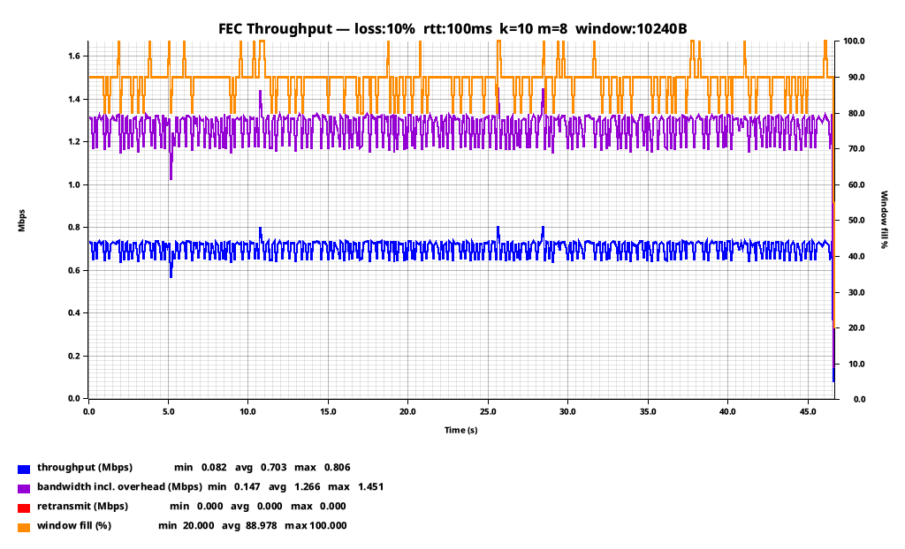
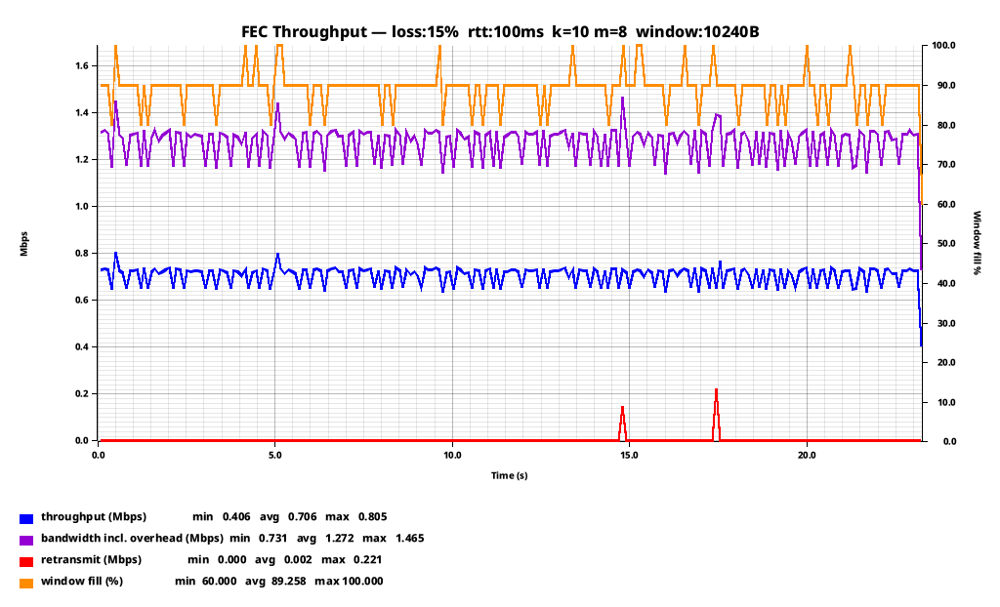
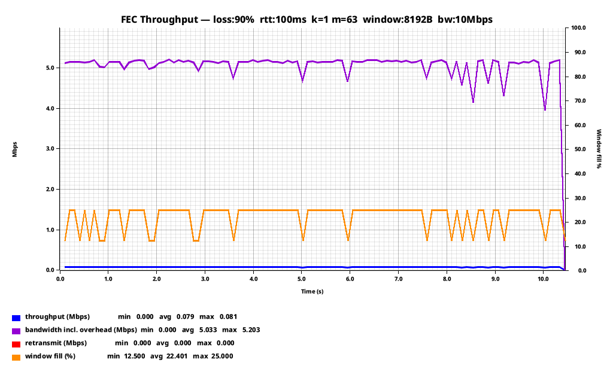
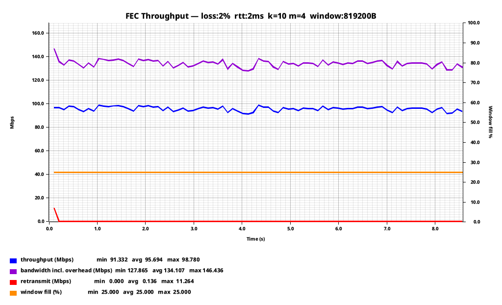
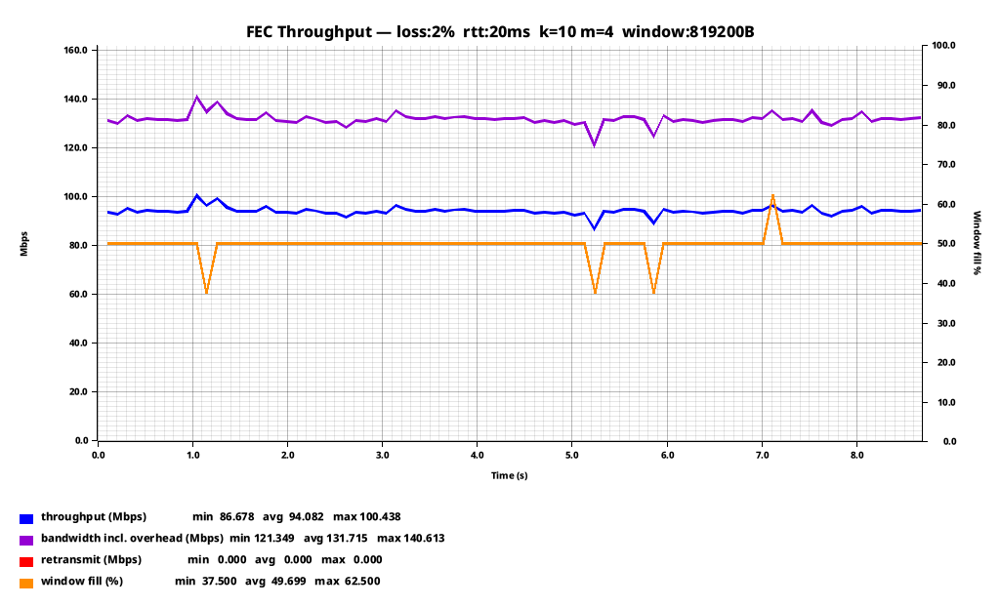

+++
title = "Reliable Delivery Over Horrible Networks: Erasure Codes"
date = 2026-09-27
draft = false
[taxonomies]
	tags = [ "Networking", "Rust", "netcode" ]
[extra]
	applet = true
+++

As we explored in the [last post](@/posts/reliable_delivery.md), sending data over cruddy networks is a fun challenge. But frankly, those mechanisms were simple, primitive, and only applicable in a very narrow set of circumstances. Now we are going to explore reliable delivery, but with even more math!

Let's say you need to deliver some big objects over a lossy, high latency pipe. As we previously explored, these suck. The combination of packet loss and high latencies makes any kind of retransmission scheme darn near impossible.

But we can't use any clever tricks like shipping a buffer because the smallest message we want to send may be larger than our MTU. Sending by TCP may be impossible because TCP's response to steady packet loss is to just back-off until conditions improve.

And bare UDP is no better. Sending via UDP (even repeatedly) will almost certainly fail because the datagram will be fragmented and the loss of any fragment will result in the datagram being un-constructable. Even at a low 1% packet loss, a datagram consisting of 10 fragments has a ~9.5% probability of experiencing a failure.

So, we can't retransmit, and we can't spam the message. What can we do? We need a mechanism that will ensure the other side gets enough pieces to reconstruct the message. But just duplicating each chunk would be terribly inefficient.

Fortunately, there are several ways we can (within reason) guarantee the other side gets the message despite a terrible connection. In this post, we are going to look at one of the more common ones.

## Reed-Solomon Codes

Reed-Solomon erasure codes (more formally known as Reed-Solomon error correction) are a group of error-correcting algorithms devised by Irving S. Reed and Gustave Solomon in 1960. They became quite ubiquitous, found in everything from hyperscale distributed storage systems to CDs and DVDs, as well as in a lot of prior art in network and radio transmission systems such as WiMAX and the venerable RAID 6.

What Reed-Solomon does is allow you to break your data down into an arbitrary number of `k + m` shards, where `k` are equal chunks of the original message, and `m` are parity shards of equal size. Any `k` number of shards (regardless of whether they are the original data, or parity) are sufficient to decode the original message. Assembling all of the `k` shards is less CPU intensive, though, since you simply concatenate them together.

So, you split your bytes up into shards (parity and data), and then transmit those shards individually instead of your original object. If enough of them make it to the other side, the original bytes can be decoded on the other side.

Play around with the calculator below to see how much shard/packet loss different `k` and `m` values will tolerate.

{{ reed_solomon() }}

## Simple Reed-Solomon Erasure Coded Protocol

So how do we actually go about using this? Quite simply as it turns out. Let's take a look at an example:

```rust
use parity_scale_codec::{Decode, DecodeAll, Encode};

/// Conservative shard payload ceiling: MTU (1500) minus IPv4 (20) + UDP (8) + worst-case
/// protocol header overhead.
pub const MAX_SHARD_SIZE: usize = 1400;

/// Maximum total shards per block (n_data + n_parity).
/// Fits in a u64 bitmask; sufficient for any practical RS configuration.
pub const MAX_TOTAL_SHARDS: usize = 64;

/// Opaque monotonically-increasing identifier for a group of shards encoded together.
pub type BlockId = u32;

/// A single data or parity shard, carried in one UDP datagram.
///
/// Reed-Solomon requires all shards in a block to be the same byte length. The sender
/// zero-pads the last data shard to reach that length; `original_len` lets the receiver
/// strip the padding after reconstruction.
///
/// Shard indices are divided as follows within each block:
///   `[0, n_data)`              → data shards (original payload, possibly padded)
///   `[n_data, n_data+n_parity)` → parity shards (repair symbols)
///
/// Any `n_data` shards out of the `n_data + n_parity` total are sufficient to
/// reconstruct the block.
#[derive(Debug, Clone, PartialEq, Encode, Decode)]
pub struct ShardPacket {
    /// Block this shard belongs to.
    pub block_id: BlockId,
    /// Position within the block: data shards first, then parity.
    pub shard_index: u8,
    /// k: number of data shards. Receiver needs any k shards to reconstruct.
    pub n_data: u8,
    /// m: number of parity (repair) shards. Surviving up to m losses is guaranteed.
    pub n_parity: u8,
    /// Byte length of the original un-padded block data.
    /// Used to trim the recovered payload after decoding.
    pub original_len: u32,
    /// Shard bytes. Every shard in the same block has identical length.
    pub payload: Vec<u8>,
}

/// Sent by the receiver to confirm that a block was successfully decoded.
#[derive(Debug, Clone, PartialEq, Encode, Decode)]
pub struct BlockAck {
    pub block_id: BlockId,
}
```

Here are some of our basic messages. The `ShardPacket` is the main message that is going to do our heavy lifting. It has a block_id, which allows for multiplexing and interleaving of sends (as the receiver can tell packets for different objects apart), and a shard_index, which tells the receiver what position to place this packet in the decoder.

We also include three items of metadata: the number of data shards, the number of parity shards, and the original length of the object. Since this is a protocol designed to tolerate loss, we don't know which of our packets will actually get to the host, so doing some kind of handshake at the start of each object send wouldn't be wise. If we are using a code with `m:20`, we could lose the first 20 packets and still be able to decode the object in the end. So the small (6 byte) overhead is well worth it.

For the return path, upon successfully decoding an object, the receiver will return a `BlockAck` with the block_id that was decoded.

As for the actual encoding of blocks, the Rust crate I used for this example makes this very easy:

```rust
use reed_solomon_erasure::galois_8::ReedSolomon;

use super::types::{BlockId, ShardPacket, MAX_TOTAL_SHARDS};

/// Encode `data` into `n_data + n_parity` [`ShardPacket`]s for a single block.
///
/// All shards are the same byte length.  The last data shard is zero-padded if
/// `data.len()` is not an exact multiple of `n_data`; `original_len` in every
/// packet carries the true length so the receiver can strip the padding.
pub fn encode_block(
    data: &[u8],
    block_id: BlockId,
    n_data: u8,
    n_parity: u8,
) -> anyhow::Result<Vec<ShardPacket>> {
    anyhow::ensure!(n_data >= 1, "n_data must be >= 1");
    anyhow::ensure!(n_parity >= 1, "n_parity must be >= 1");
    anyhow::ensure!(
        n_data as usize + n_parity as usize <= MAX_TOTAL_SHARDS,
        "n_data ({n_data}) + n_parity ({n_parity}) exceeds MAX_TOTAL_SHARDS ({MAX_TOTAL_SHARDS})"
    );

    let k = n_data as usize;
    let m = n_parity as usize;
    let original_len = data.len() as u32;

    // Shard size: ceiling division, minimum 1 to avoid zero-length shards.
    let shard_size = ((data.len() + k - 1) / k).max(1);

    // Pad data to exactly k * shard_size bytes.
    let mut padded = data.to_vec();
    padded.resize(k * shard_size, 0);

    // Build the shard vec: k data shards followed by m zeroed parity slots.
    let mut shards: Vec<Vec<u8>> = padded.chunks(shard_size).map(<[u8]>::to_vec).collect();
    shards.extend((0..m).map(|_| vec![0u8; shard_size]));

    let rs = ReedSolomon::new(k, m)
        .map_err(|e| anyhow::anyhow!("ReedSolomon::new failed: {e:?}"))?;
    rs.encode(&mut shards)
        .map_err(|e| anyhow::anyhow!("encode failed: {e:?}"))?;

    Ok(shards
        .into_iter()
        .enumerate()
        .map(|(i, payload)| ShardPacket {
            block_id,
            shard_index: i as u8,
            n_data,
            n_parity,
            original_len,
            payload,
        })
        .collect())
}
```

Sizing your receive and retransmission buffers means balancing memory usage against how many blocks you're willing to have in flight at once, since both sender and receiver need enough room to hold them. The good news is that the FEC overhead doesn't inflate that math: you only ever need to hold one object's worth of data in the receive buffer, because as soon as the last piece needed to decode it arrives, any leftover shards for that object can be dropped. So you can still size your buffers to roughly your bandwidth delay product, protocol overhead aside.

Another thing worth mentioning is that it does take more CPU to reconstruct objects from parity than it does to simply concatenate all the data blocks together, so I would definitely ensure that your protocol sends all of the data blocks first. On a healthy connection, this will reduce CPU usage on the receiver.

With all of this, we have a pretty good delivery system that passively tolerates some loss. But for a truly reliable program, that isn't enough, and we still need a back-up system.

## Retransmission

```rust
/// Sent by the receiver when a block cannot yet be recovered (timeout before n_data shards arrived).
///
/// The sender uses `received_mask` for selective retransmit: only missing shards are resent.
#[derive(Debug, Clone, PartialEq, Encode, Decode)]
pub struct BlockNack {
    pub block_id: BlockId,
    /// Bitmask of received shards: bit i is set iff shard_index i arrived.
    /// Bit width is sufficient for n_total ≤ MAX_TOTAL_SHARDS.
    pub received_mask: u64,
}
```

After seeing the first packet for a given `block_id`, the receiver will start emitting `BlockNacks` if it cannot decode the block within a given timeout. And in this packet, quite a bit is communicated in a very small number of bytes.

The `block_id` is the same as above, but the `received_mask` is quite interesting. It's a bitmask of each shard. From this one integer, the sender can derive exactly which parity/data shards it needs to resend from the retransmit buffer:

As a small example, say `n_data = 4` and `n_parity = 2` (6 shards total), and the receiver only got shards 0, 2, and 4 before giving up and sending a `BlockNack`:

```
shard_index:  0  1  2  3  4  5
              └── data ──┘└parity┘
arrived?      ✓  ✗  ✓  ✗  ✓  ✗
mask bit:     1  0  1  0  1  0
```

Read as an integer, those bits are `received_mask = 0b010101` (`0x15`, 21 decimal). The sender doesn't have to guess or ask which shards are missing. It just scans the mask for `0` bits and resends exactly those: shard 1 and shard 3 (data), and shard 5 (parity).

And this allows for another neat trick as well: the sender can measure packet loss in one direction without sequence numbers or any other fancy analytical machinery. This can even be used as a feedback mechanism for the sender to dynamically adjust its coding rate (`k + m`)!

## Dynamic M

It's important to understand that the superpower of an FEC scheme is not in its retransmission mechanism, however efficient that might be. Using Reed-Solomon codes to send traffic in the first place incurs overhead, so in order to make the trade-off in overhead worth it, you should make sure that your delivery has a high chance of succeeding on the first try. The best way to do this is to make your protocol aware of the current link conditions and have it dynamically select `m` based on that.

To see why that matters, it helps to look past a single roll of the dice and ask: across a whole spread of packet loss rates, what's the actual probability that a block gets through on the first try for a given `k + m`? Set `k` and `m` below and the table works out `P(success)` (and its complement) at each loss rate exactly:

{{ delivery_probability() }}

Notice how a fixed coding rate can go from comfortably safe to essentially guaranteed failure over a fairly narrow band of loss rates. That's the argument for measuring current conditions and feeding them back into `m`, rather than picking one static value and hoping it holds.

## The Ack Problem

But if you implemented this protocol exactly as described, it wouldn't work well in practice. Data flows cleanly from sender to receiver, and assuming you can tolerate the overhead, you can transfer a considerable amount of data over pretty terrible connections. The problem is that acks and nacks travel over the same lossy link that made you reach for FEC in the first place, so the sender ends up not clearing its retransmission buffer fast enough. On a `10 + 10` code over a connection with 20% packet loss, delivery of objects is virtually guaranteed, but you'll still wind up retransmitting (or stalling on) 20% of your objects anyway, simply because 20% of the receiver's acks never made it back.

The naive solution is to simply code the acks as well, but an ack is an extremely small message, and nacks aren't much larger. If you remember the [previous post](@/posts/reliable_delivery.md), this follows a pattern that our previous "Ring Buffer" reliability protocol solves very well. So one solution is to keep a ring buffer of acks, and transmit the last several acks along with every new ack. That way, on a channel with steady-state transmissions, the acks will also gain a level of reliability.

```rust
/// Owns the outgoing ACK ring buffer.
async fn ack_sender_task(
    mut cmd_rx: mpsc::Receiver<AckCmd>,
    sock: Arc<UdpSocket>,
    peer_addr: SocketAddr,
    n_data: u8,
    n_parity: u8,
) {
    let mut ring: VecDeque<BlockAck> = VecDeque::new();
    let mut batch_id: u32 = 0;

    while let Some(AckCmd::Decoded(block_id)) = cmd_rx.recv().await {
        ring.push_back(BlockAck { block_id });
        trim_to_mtu(&mut ring);
        batch_id = batch_id.wrapping_add(1);
        send_ack_batch(&ring, &sock, peer_addr, batch_id, n_data, n_parity).await;
    }
}
```

Every new decode appends to the ring and resends the whole thing, so any single ack getting through carries several of its predecessors along with it. In practice you'll also want to resend the ring on a timer during idle periods (so it drains even if no new blocks arrive) and cap how many times you burst-resend after a decode, but that's just scheduling logic layered on top of this same core loop.

And this is probably pretty reliable by itself. But now, we have turned a bunch of small acks back into a large object. If we have extra bandwidth to spend, we can also just FEC encode the ring buffer full of acks as well:

```rust
/// FEC-encode the ACK ring and send each shard as `Packet::AckShard`.
/// The sender accumulates shards by `batch_id` and decodes when n_data arrive,
/// gaining the same loss protection as data shards at the same overhead.
async fn send_ack_batch(
    ring: &VecDeque<BlockAck>,
    sock: &UdpSocket,
    peer_addr: SocketAddr,
    batch_id: u32,
    n_data: u8,
    n_parity: u8,
) {
    let acks: Vec<BlockAck> = ring.iter().cloned().collect();
    let payload = encode_ack_batch(&acks);
    if let Ok(shards) = encode_block(&payload, batch_id, n_data, n_parity) {
        for shard in shards {
            let bytes = Packet::AckShard(shard).encode_to_vec();
            let _ = sock.send_to(&bytes, peer_addr).await;
        }
    }
}
```

And while this does add overhead, the acks...again...are tiny. There are lots of tradeoffs here, which result in a lot of knobs to turn, but if you have constant steady-state packet loss and you want your buffers as close to the bandwidth delay product as possible, spending a comparatively small amount of overhead on making your ack delivery more reliable is probably worth it.

## Erasure Coding In Practice

Practically speaking, the theory applies very well in practice. At least, so long as you test with tools that assume each packet has an independent probability of being lost (we will explore a more realistic loss profile and what you can do about it in a future article).

For instance, at `k=10 m=8` with 10% packet loss, theory predicts a lost block roughly once every 47,900:



```
--- Summary ---
Loss rate:             10.0%
RTT (final est.):    102.96ms
Blocks pushed:          4000
Blocks delivered:       4000
Shard retransmits:         0
  via NACK:                0
  via RTO:                 0  (0 full-block events)
```

As expected, we don't even trigger the retransmission mechanism at 10% loss: all blocks were decoded on the first attempt.

At 15% packet loss, however, probability says we should fail to decode a block every 1,960:



```
--- Summary ---
Loss rate:             15.0%
RTT (final est.):    103.29ms
Blocks pushed:          2000
Blocks delivered:       2000
Shard retransmits:        45
  via NACK:                9
  via RTO:                36  (2 full-block events)
```

Theory predicted roughly one block would fail to decode outright (which requires losing 9 or more of the 18 shards, one past what `m=8` parity can cover), and in practice we ended up retransmitting 9 shards via the NACK path to recover it. On the other hand, we retransmitted 36 via RTO, but those are due to losses of acks. So the test very closely matches the theory.

For an extreme example:

90% loss rate, 100ms RTT, small window and bandwidth-limited connection:



```
--- Summary ---
Loss rate:             90.0%
RTT (final est.):    112.56ms
Blocks pushed:           100
Blocks delivered:        100
Shard retransmits:         0
  via NACK:                0
  via RTO:                 0  (0 full-block events)
```

We shrunk the 10 Mbps pipe down to a measly 79 kbps one, but passively delivering *anything* without retransmissions against 90% packet loss is no joke.

I think the most common use case for this, though, is to just pave over the first 1-3% packet loss that would result in you losing more than 2/3rds of your TCP bandwidth. For example, this clearly shows the 40% overhead you pay for running `k=10 m=4`, but pretty much all your deliveries make it the first time:



And, if you remember from the previous article, the usable bandwidth of a lossy TCP stream drops severely with latency. That's not a buffer size problem; bigger send/receive windows won't fix it. It's because congestion control only grows the congestion window by about one segment per round trip, so after a loss event, recovering back to full speed takes wall-clock time proportional to RTT. This scheme doesn't have a congestion window to collapse and slowly climb back from, so as long as you don't fill the send window, latency alone doesn't cost you *any* throughput:



## Wrapping Up

Reed-Solomon FEC gives you the option to trade off reliability for overhead. Instead of chasing dropped packets after the fact, you spend a bit of bandwidth up front so that most blocks arrive complete on the first try, even over links that are dropping a meaningful fraction of everything you send.
<br>
It's also worth remembering that everything above pairs FEC with a retransmission mechanism, but that's not a requirement. Plenty of use cases just run FEC on its own at a fixed coding rate and accept the residual failure probability, skipping acks and retransmission buffers entirely.

Perhaps the most important thing to realize is that this isn't strictly better than a pure retransmission-based reliable protocol such as TCP. As elegant a solution as erasure codes are, they're inefficient: both ends burn CPU cycles doing encodes and decodes[^1], and the sender *always* transmits more data than it strictly needs to. TCP, by contrast, transmits exactly as much data as is required and no more.

There's a second cost too: since there's no congestion control backing any of this off, a stream like this will happily fill 100% of its allotted bandwidth regardless of what else is sharing the link. It isn't a great neighbor on a connection anyone else is using, and it won't back off the way TCP will if something else needs the room.

But in two situations, retransmission-based protocols like TCP and QUIC are not ideal, and a scheme like this is far better:

The first is high-latency links. If you have a 300ms RTT, every failed delivery is going to take 300ms to resolve *in the ideal case*. More likely, the failures will stack on top of each other, and seconds will go by before delivery finally goes through. In the case of TCP, this means that for that period of time, no new data is going to make it to the other end either.

And second, there are cases where regular packet loss is expected. If you have a constant 1-2% packet loss, `k=10 m=4` virtually guarantees delivery in exchange for 40% overhead. 40% may sound like a lot, but when you consider that a 200 Mbps link with 1% packet loss, as utilized by TCP, will be capable of delivering about 40 Mbps, it starts sounding a lot better. That is an 80% reduction in bandwidth versus 40% overhead. And the higher packet loss gets, the more this trade works out in favor of passive FEC.

And bear in mind, if you do want a dynamic `m` determined by current link conditions, the state machine required on both sides of the connection is rather complex. Totally tractable, but definitely not as trivial as I've hand-waved it here.

And it's also important to mention that the testing here doesn't reflect the real world, because packet loss is not per-packet independent. For Reed-Solomon, this is actually not as big of a deal on a packet-by-packet basis: it doesn't matter which of the blocks you lose, so long as you don't lose `m` of them. But once you start multiplexing objects, short periods of loss will result in either losing blocks (or triggering your retransmission mechanism) even if your coding rate is high enough to absorb the packet loss averaged over some period of time.

And, of course, there are also solutions for that. But we will have to talk about those next time.

<br>
<br>
<br>
<br>
<br>
[^1]: And until recently, CPUs were not great at doing multiplication and division in a Galois field, which made this significantly worse.
